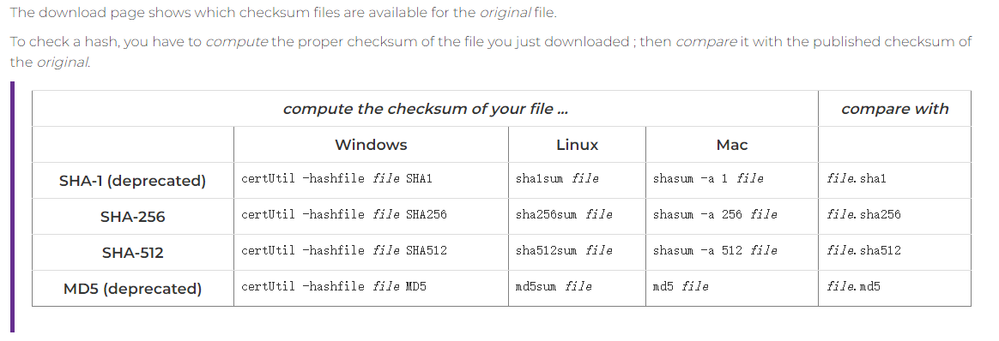

# Linux

## GPG

gpg、pgp、openssl

[2021年，用更现代的方法使用PGP（上）](https://zhuanlan.zhihu.com/p/344198727)

PGP、OpenPGP、GnuPG 和 gpg
我们需要知道PGP、OpenPGP、GnuPG 和 gpg 之间的不同：

- PGP （“Pretty Good Privacy”） 是最初商业软件的名字
- OpenPGP 是与最初 PGP 工具兼容的 IETF 标准
- GnuPG （“Gnu Privacy Guard”）是实现了 OpenPGP 标准的自由软件
GnuPG 的命令行工具称为 “gpg”

### 使用gpg验证apache发布的软件
[VERIFYING APACHE SOFTWARE FOUNDATION RELEASES](https://www.apache.org/info/verification.html)

#### 通过计算hash值验证文件完整性
计算文件hash值验证文件完整性，原文查看以上链接

<table>
<capital>如何在Markdown里面画这样的表格：</capital>
<tr>
<th>SHA-256</th>
<td>certUtil -hashfile file SHA256</td>
<td>sha256sum file</td>
<td>shasum -a 256 file</td>
<td>file.sha256</td>
</tr>
<tr>
<th>SHA-512</th>
<td>certUtil -hashfile file SHA512</td>
<td>sha512sum file</td>
<td>shasum -a 512 file</td>
<td>file.sha512</td>
</tr>
<tr>
<table>



#### 使用GPG验证
```shell
% gpg --verify httpd-2.0.44.tar.gz.asc httpd-2.0.44.tar.gz
gpg: Signature made Sat Jan 18 07:21:28 2003 PST using DSA key ID DE885DD3
gpg: Can't check signature: public key not found

% gpg --keyserver pgpkeys.mit.edu --recv-key DE885DD3

% gpg --fingerprint DE885DD3

% gpg --verify httpd-2.0.44.tar.gz.asc httpd-2.0.44.tar.gz

```
