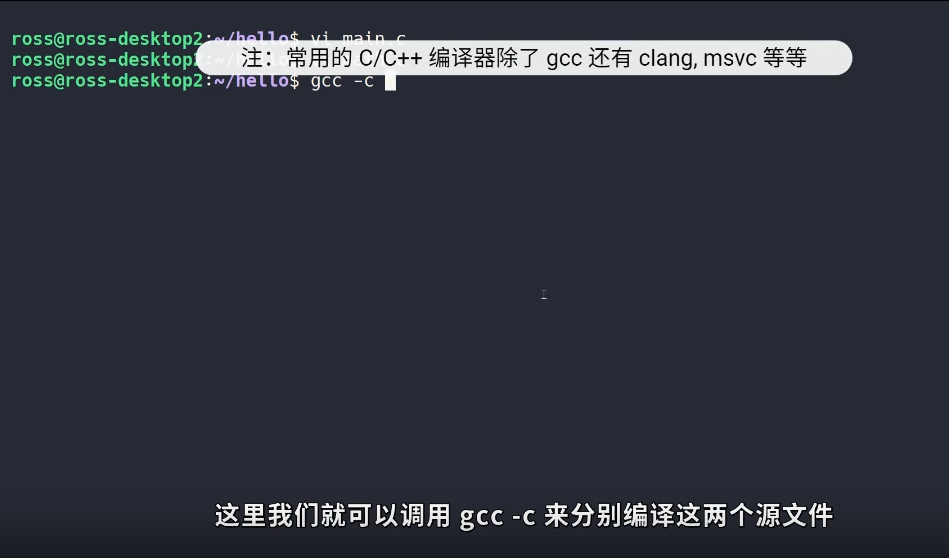

# 20220621

[隐藏的细节：编译与链接](https://www.bilibili.com/video/BV1TN4y1375q)

## 编译


1. main.c调用math.c的方法

- 使用gcc编译两个文件
  

 - 编译是以单个源文件为单位的，如果只更改一个文件，可以只编译该文件

 - .c 被编译为.o文件（object file），是二进制文件，文件格式为ELF

- ELF为linux下所有可执行文件的通用格式，Windows下的可执行文件格式为PE（Portable Executable）,两者都是对二进制代码的封装


```shell
readelf -h main.o
OS/ABI:操作系统
Machine:机器类型

readelf -S main.o

```


.text 代码
.data 变量


mian.o，不能直接执行。由于main.o中的还要引用math.c中其他方法（以及/usr/include/stdio.h的printf等方法）。
编译main.c时，编译器还不知道printf，add等函数存在。编译器会将这些函数的跳转地址先设置为0，随后链接的时候去修正它。

```
# 查看目标文件内容
objdump -s -d main.o
```


重定位表和上面的机器代码是一一对应的

```
# 重定位表
objdump -r main.o
```


## 链接


如果只编译一个文件,则会有编译错误
```
gcc mian.o -o main
```


## makefile

AndroidOS构建用到了makefile

makefile核心是对依赖（Dependency）的管理

```makefile
all: main

main: main.o math.o
        gcc main.o math.o -o mian

main.o: main.c
        gcc -c main.c

main.o: math.c
        gcc -c math.c

clean:
        rm main main.o math.o
```


现在所有的现代化构建工具都利用了相同的原理--队依赖的管理，只不过会加入一些使用功能如脚本支持，第三方库管理之类。

**学习CMake**
