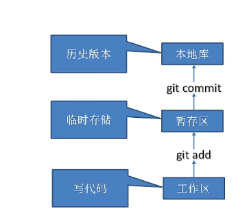
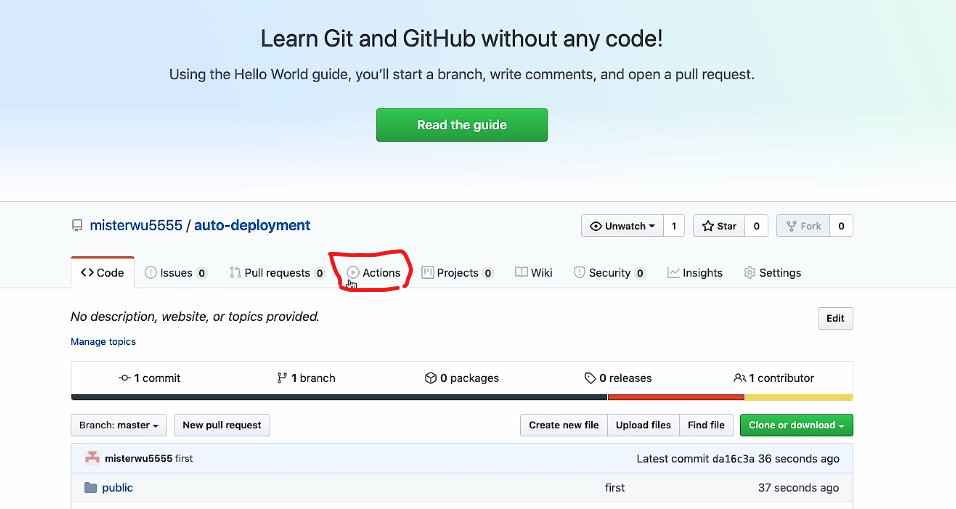
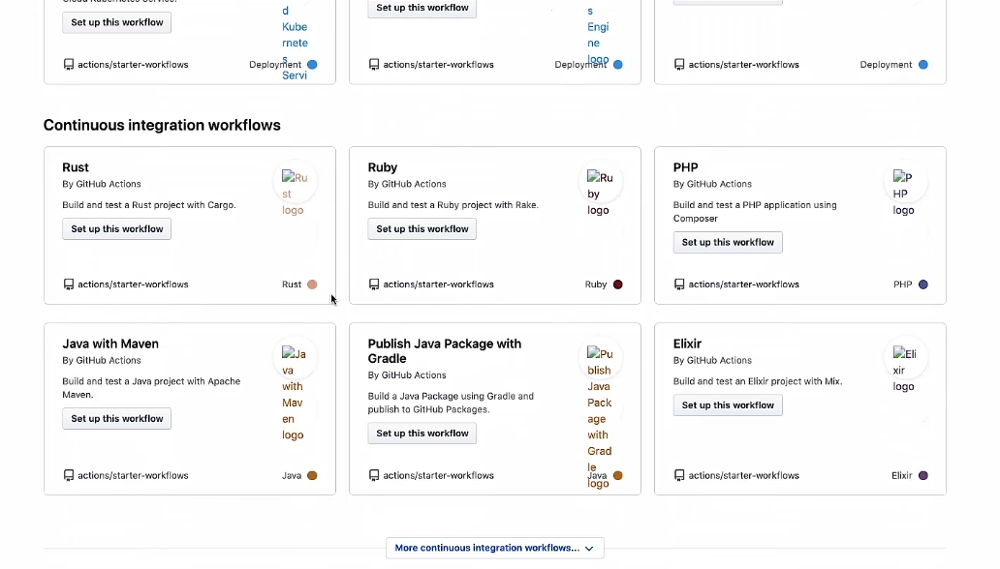
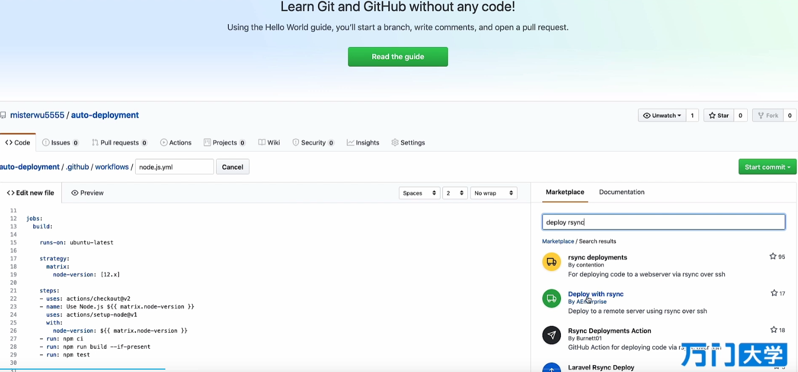
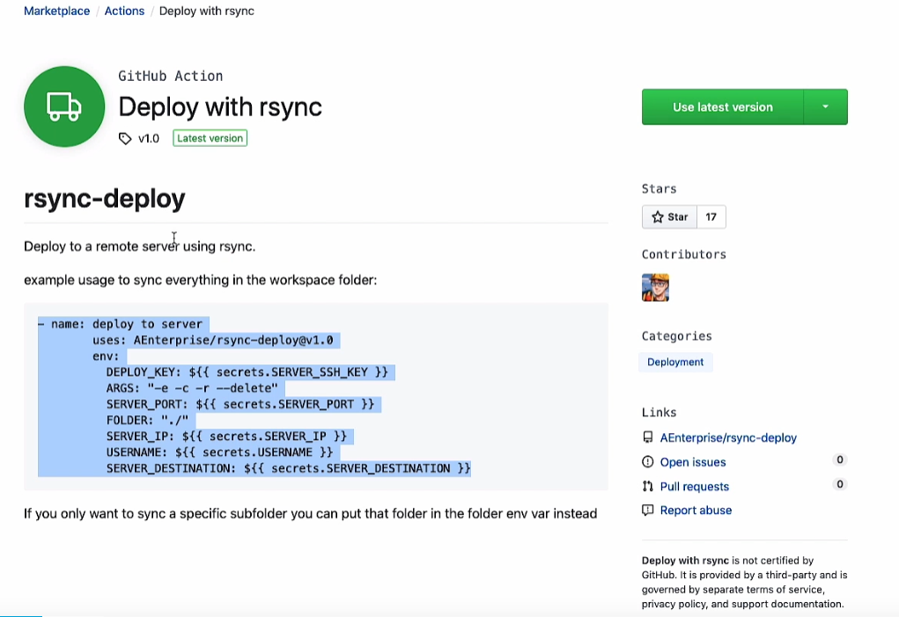

## git代码控制
### 1、下载git
[git下载地址](https://git-scm.com)
[git菜鸟教程](https://www.runoob.com/git/git-basic-operations.html)
[git博文](https://www.cnblogs.com/miracle77hp/articles/11163532.html)

git工作机制



### 2、git操作
```shell
设置用户签名：
git config --global user.name "<user.name>"
git config --global user.email "<user.email>"

初始化本地库：
git init

查看本地库状态：
git status

第一次提交：
git remote add origin master

添加到暂存区：
git add

提交到本地库：
git commit -m "msg" \<filename>

提交到远程库：
git push -u origin master

git pull

查看日志：
git reflog   查看历史记录
git log

版本切换：
git reset --hard <version>

创建分支：
git branch <分支名>

查看分支：
git branch -v

转换分支：
git checkout <分支名>

把指定<分支名>分支合并到当前分支：
git merge <分支名>

git remote -v

git stash
 ```

**分支合并**
- 正常合并
```git merge```

- 代码冲突
```txt
1、git merge   
发生Conflicts
(状态：master|MERGING)
2、修改文件
3、git commit -m "<msg>"
(不添加文件名，因为git不知道是哪个分支的文件名)
 ```

### 3、idea接管git项目

**配置git**
安装git默认会自动配置
settings ==> Version Control ==> Git

**配置把项目添加到git**
点击VCS(version control service) ==> 
Import into Version Control ==>
Create Git Repository


**git ignore 文件模板**
```txt
 # Compiled class file
*.class

 # Log file
*.log

 # BlueJ files
*.ctxt

 # Mobile Tools for Java (J2ME)
.mtj.tmp/# Package Files #
*.jar
*.war
*.nar
*.ear
*.zip
*.tar.gz
*.rar

hs_err_pid*

.classpath
.project
.settings
target
.idea
*.iml
 ```

**.gitconfig文件中引用忽略配置文件**
idea中会自动配置
文件默认在用户文件夹下
```txt
[user]
    name = mume
    email = mume@email.com
[core]
    excludesfile = D:/Project/.../.../git.ignore
 ```

#### gitLab安装

[gitlab官网使用docker安装](https://docs.gitlab.com/ee/install/docker.html)

```shell
sudo docker run --detach \
  --hostname gitlab.example.com \
  --publish 443:443 --publish 80:80 --publish 222:22 \
  --name gitlab \
  --restart always \
  --volume $GITLAB_HOME/config:/etc/gitlab \
  --volume $GITLAB_HOME/logs:/var/log/gitlab \
  --volume $GITLAB_HOME/data:/var/opt/gitlab \
  --shm-size 256m \
  gitlab/gitlab-ce:latest
 ```

```shell
docker run -d \
 -p 443:443 -p 80:80 -p 222:22 --name gitlab \
 --restart always \
 -v /home/gitlab/config:/etc/gitlab \
 -v /home/gitlab/logs:/var/log/gitlab \
 -v /home/gitlab/data:/var/opt/gitlab \
 gitlab/gitlab-ce
```

gitlab-ctl reconfigure
gitlab-ctl start
gitlab-ctl stop


```txt
# 配置http协议所使用的访问地址,不加端口号默认为80
external_url 'http://139.196.143.83'

# 配置ssh协议所使用的访问地址和端口
gitlab_rails['gitlab_ssh_host'] = '139.196.143.83'
gitlab_rails['gitlab_shell_ssh_port'] = 222 # 此端口是run时22端口映射的222端口
```

#### git fork 后提交代码
git fork 后，在github/gitlab中，点击Merge Requests进行提交，作者确认后，作者可以点击merge提交

#### github/gitLab自动部署

###### 1、git从本地提交代码
```
git push
```

###### 2、github中配置自动部署
1. 点击Actions ==>
2. Continuous Integration workflows ==> 
3. 寻找部署所需要的环境 (nodejs、java等) ==> 
4. Set up this workflow ==>
5. 右侧Marketplace ==>
6. view full Marketplace listing ==>
7. 复制类似以下代码，至node.js.yml - run 下
```yml
- name: deploy to server
    uses: AEnterprise/rsync-deploy@1.0
    env:
        DEPLOY_KEY: ${{secrets.SERVER_SSH_KEY}}
        ARGS: "-e -c -r --delete"
        SERVER_PORT: ${{ secrets.SERVER_PORT }}
        FOLDER: "dist/"  #本地文件目录
        SERVER_IP: ${{ secrets.SERVER_IP }}
        USERNAME: ${{ secrets.USERNAME }}
        SERVER_DESTINATION: ${{ secrets.SERVER_DESTINATION }} #服务器地址
```

8. 配置上面yml中的变量
Settings ==> Secrets ==> new Secret
9. 本地创建ssh私钥，公钥上传服务器

```batch
ssh-keygen -t rsa -C ""
ssh-keygen -t rsa -C "auto" -f deployment
-t 加密算法
-C 描述
-f ssh文件名地址
```





**如果是前端，则使用Node.js**







###### 3、gitlab-Runner (Gitlab CI/CD)
**实现GitLab CI/CD**
(continuous integration/continuous Deployment)

[gitrunner创建不成功解决方案](https://www.gitlab.com/gitlab-org/gitlab-runner/~/issues/3750)

```shell
gitlab-runner register --non-interactive --executor 'shell' --url 'https://gitlab.com/' --registration-tokenn '<token>'
```

###### 1、创建.gitlab-ci.yml
```yml
image: node:latest
publish_package:
    stage: deploy
    script: 
        - npm install
        - npm run build
```


### github操作

#### github快捷键
t键：根据查询仓库的文件
l键：调转到查看文件的某一行
b键：快速查看文件的改动记录

[github快捷键](https://docs.github.com/cn/get-started/using-github/keyboard-shortcuts#source-code-browsing)


ctrl+k:命令行

[github命令面板](https://docs.github.com/cn/get-started/using-github/github-command-palette)

[github官方文档](https://docs.github.com/cn)

[github/gitpod教程（鱼皮）](https://github.com/youhuangla/Note/blob/main/web/github.md)


### gitpod使用（在线）
在github项目前加上
```
gitpod.io/#/
ex: https://github.com/nginx/nginx => https://gitpod.io/#/github.com/nginx/nginx
```

