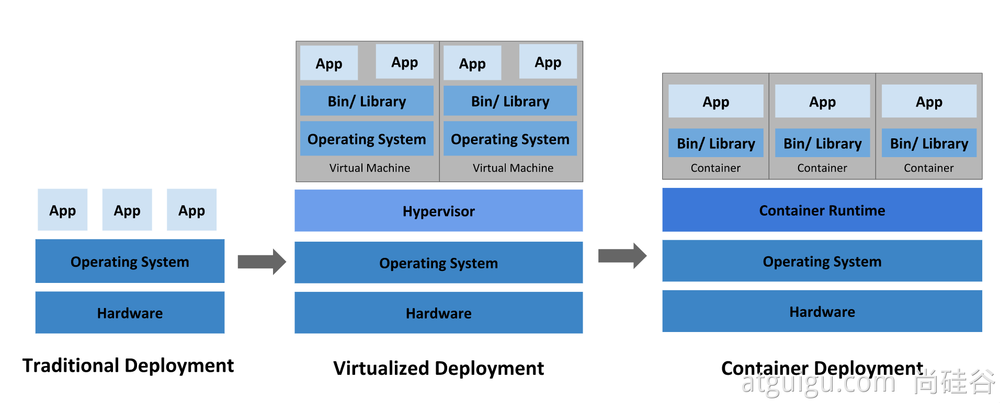
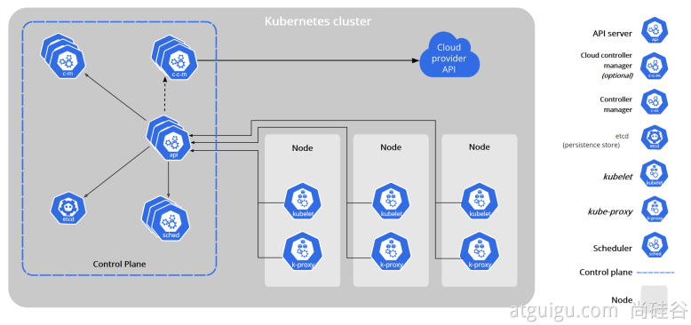
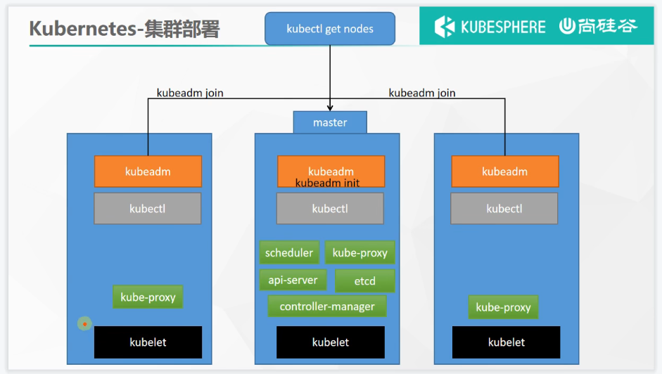

# 云原生

## Docker
[Docker具体笔记](/云原生/Docker/docker.md)

## Kubernetes(K8s)

[云原生实战笔记(K8s)](https://www.yuque.com/leifengyang/oncloud/ghnb83)

[k8s官方文档](https://kubernetes.io/zh/docs/concepts/overview/what-is-kubernetes/)

### 概念、特性

Kubernetes 是一个可移植、可扩展的开源平台，用于管理容器化的工作负载和服务，可促进声明式配置和自动化。

- 服务发现和负载均衡
- 存储编排
- 自动部署和回滚
- 自动完成装箱计算
- 自我修复
- 密钥与配置管理

### 架构

Kubernetes Cluster = N Master Node + N Worker Node：N主节点+N工作节点； N>=1


### 安装
docker+kubelet  必须的服务
kubectl 用户命令组件
kubeadm 集群配置服务



#### 准备工作
- 一台兼容的 Linux 主机。Kubernetes 项目为基于 Debian 和 Red Hat 的 Linux 发行版以及一些不提供包管理器的发行版提供通用的指令
- 每台机器 2 GB 或更多的 RAM （如果少于这个数字将会影响你应用的运行内存)
- 2 CPU 核或更多
- 集群中的所有机器的网络彼此均能相互连接(公网和内网都可以)
  - 设置防火墙放行规则
- 节点之中不可以有重复的主机名、MAC 地址或 product_uuid。请参见这里了解更多详细信息。
  - 设置不同hostname
- 开启机器上的某些端口。请参见这里 了解更多详细信息。
  - 内网互信
- 禁用交换分区。为了保证 kubelet 正常工作，你 必须 禁用交换分区。
  - 永久关闭


[kubeadm安装准备](https://kubernetes.io/zh/docs/setup/production-environment/tools/kubeadm/install-kubeadm/)

#### 安装k8s
##### 安装服务
docker+kubelet  必须的服务
kubectl 用户命令组件
kubeadm 集群配置服务
[aliyun提供的在ubuntu中安装k8s的方法](https://developer.aliyun.com/mirror/kubernetes)


[Ubuntu 20 kubernetes集群 安装配置_2022年02月10日最新可用](https://blog.csdn.net/xiaozi_001/article/details/122869165)
[kubeadm安装依赖镜像](https://segmentfault.com/a/1190000038248999)

##### 配置
1. 配置hosts
```bash
echo "192.168.75.101 cluster-endpoint" >> /etc/hosts

# 查看当前配置中需求的镜像
kubeadm config images list

root@k8smaster:~# kubeadm config images list
k8s.gcr.io/kube-apiserver:v1.24.1
k8s.gcr.io/kube-controller-manager:v1.24.1
k8s.gcr.io/kube-scheduler:v1.24.1
k8s.gcr.io/kube-proxy:v1.24.1
k8s.gcr.io/pause:3.7
k8s.gcr.io/etcd:3.5.3-0
k8s.gcr.io/coredns/coredns:v1.8.6


sudo tee ./images.sh <<-'EOF'
#!/bin/bash
images=(
kube-apiserver:v1.24.1
kube-controller-manager:v1.24.1
kube-scheduler:v1.24.1
kube-proxy:v1.24.1
pause:3.7
etcd:3.5.3-0
coredns:v1.8.6
)
for imageName in ${images[@]} ; do
docker pull registry.cn-hangzhou.aliyuncs.com/google_containers/$imageName
docker tag registry.cn-hangzhou.aliyuncs.com/google_containers/$imageName k8s.gcr.io/$imageName
docker rmi registry.cn-hangzhou.aliyuncs.com/google_containers/$imageName
done
EOF


kubeadm init \
--apiserver-advertise-address=192.168.75.101 \
--control-plane-endpoint=cluster-endpoint \
--kubernetes-version v1.20.9 \
--service-cidr=10.96.0.0/16 \
--pod-network-cidr=172.31.0.0/16


kubeadm init \
--apiserver-advertise-address=192.168.75.101 \
--control-plane-endpoint=cluster-endpoint \
--image-repository registry.cn-hangzhou.aliyuncs.com/lfy_k8s_images \
--kubernetes-version v1.20.9 \
--service-cidr=10.96.0.0/16 \
--pod-network-cidr=172.31.0.0/16
```


### 命令


