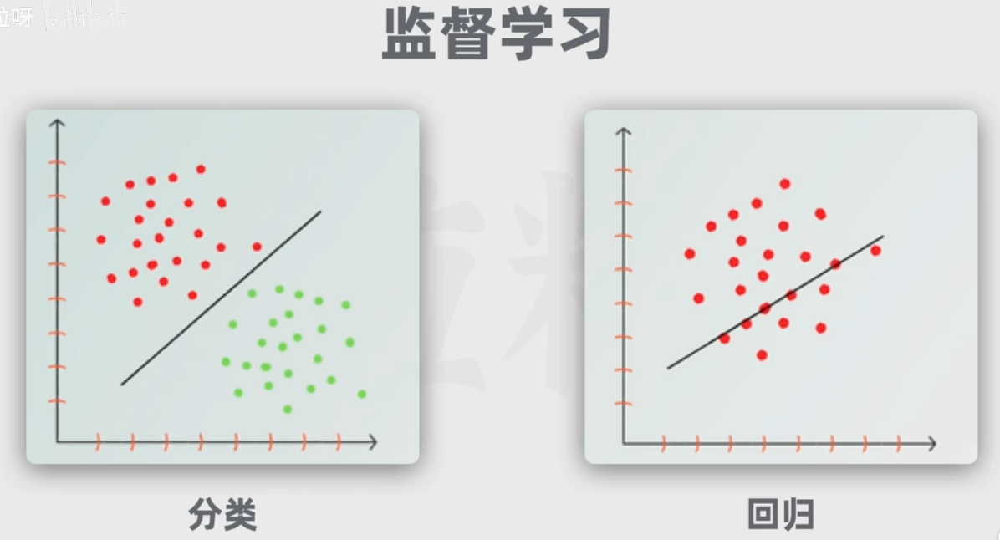

# AIGC
[啥是“AIGC”？带你分清一堆AI技术词 | AI大模型科普1](https://www.bilibili.com/video/BV1oy4y1A7aW)

AI Generated Content
Generative AI 生成式AI
生成式AI  生成   AIGC

## Artifical Intelligence

### Machine Learning 机器学习：自行识别模式，总结规律

#### 监督学习
算法接触有标签的训练数据，标签是期望的输出值，数据包括数据特征和期望输出值。算法学习输入和输出的关系

- 分类

识别猫狗动物
- 回归

根据房子条件预测房价

#### 无监督学习
- 无监督学习之聚类

把数据进行分组，如新闻文章，模型根据主题和内容的特征进行，自动把相似文章组织

#### 强化学习
让模型在环境采取行动，获得结果反馈，从反馈中学习。从而在给定情况下采取最佳行动。最大化奖励或者最小化损失。

  

#### 深度学习

- 生成式AI
  深度学习的一种应用
  
- 大预言模型LLM(Large Language Model)
  
  
  