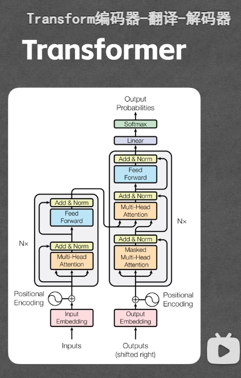
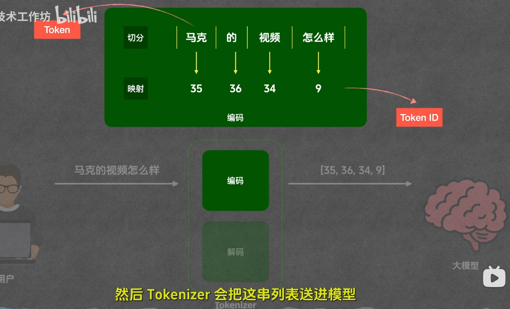
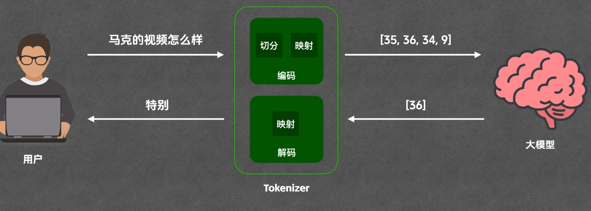
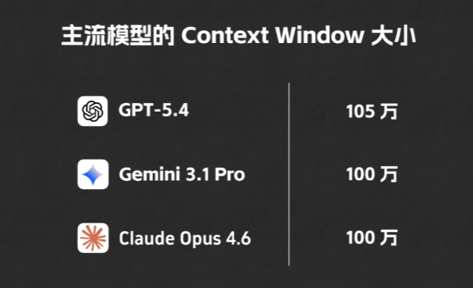
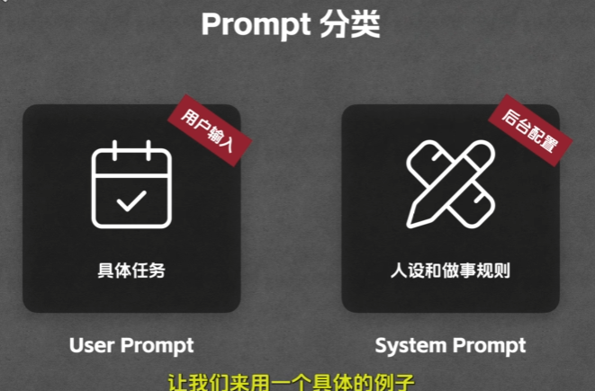
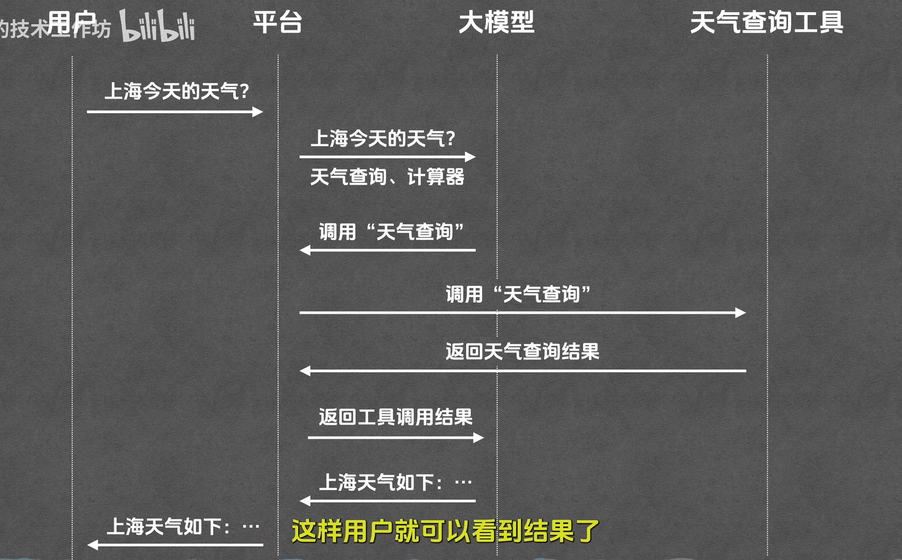
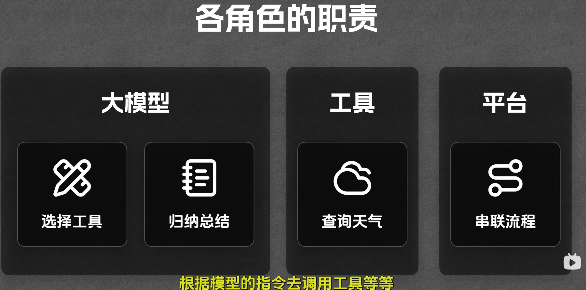
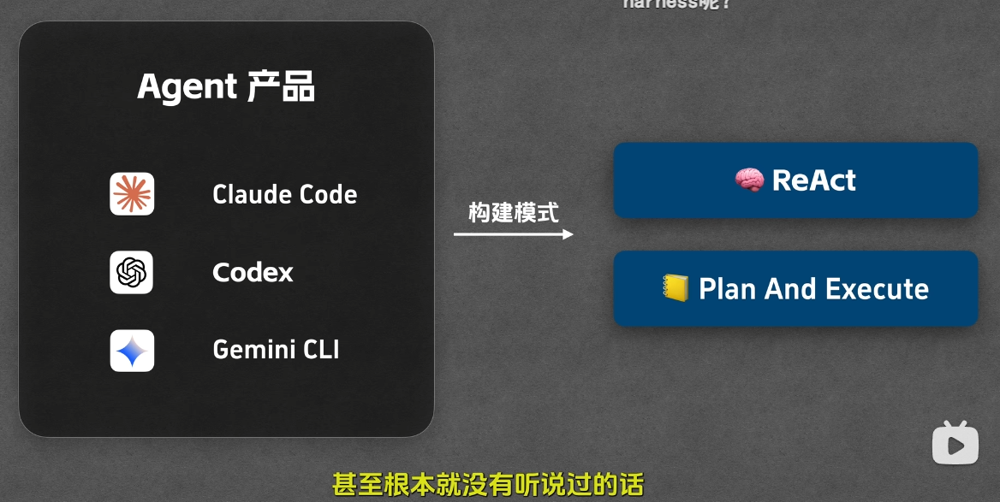

# AI概念
[从 LLM 到 Agent Skill](https://www.bilibili.com/video/BV1E7wtzaEdq)

"LLM" 语言文本模型
"Token" LLM的输出输出，输入的Token通常比输出Token要贵好几倍，看不同厂商。
"Context" 上下文
"Prompt" 提示词，现在的大部分的产品，不仅仅是个LLM了，基本都进化成Agent了。进化的核心就是因为prompt，在Agent上prompt其实更多是定义Agent本身的能力以及约束，这部分就是system prompt，用户输入你好，背后Agent会携带很多东西给LLM，所有这些Agent提交给LLM的内容组合起来就是输入的Token了。
"loop" Agent的另一个核心，Agent本身如何与接入的LLM循环调用，达到目的。
"Tool" 工具，有内置工具，像openclaw就只有4个内置工具，但是可以做一切的事情 read write edit bash。外置工具，可以自己写，也可以用别人做好的。mcp可以理解为Agent的外包，将这一个领域的所有工具都外包给了这个mcp。

## LLM(Large Language Model)
大语言模型
Transfomer


## Token
令牌
切分文本为令牌(Token)
映射令牌为tokenid
向量表示令牌的语义信息
tokenization



openai 拆解token
[token拆解查看](https://platform.openai.com/tokenizer)

## Context
上下文
上下文是指在LLM中，用户输入的文本，以及用户之前的所有文本，这些文本的组合，就是上下文。

Context Window
上下文窗口
代表Context能容纳的最大Token数


## Prompt
提示词
提示词是指在LLM中，用户输入的文本，以及用户之前的所有文本，这些文本的组合，就是提示词。

prompt Engineering
提示词工程

### Prompt分类

User Prompt
用户输入的文本


System Prompt
系统提示词
系统提示词是指在LLM中，用户输入的文本，以及用户之前的所有文本，这些文本的组合，就是系统提示词。

## Tool
工具，本质上是一个函数。



## MCP
Model Context Protocol
模型上下文协议，统一的工具接入标准

MCP是统一的接入规范

## Agent
智能体
能够自主规划任务，自主规划调用工具，直至完成用户任务的系统为agent



## Agent Skill
智能体技能
给Agent看的说明文档，本质是一个markdown文档
[Agent Skill 网站](https://www.skills.sh/)

[https://hub.cocoloop.cn/](https://hub.cocoloop.cn/)

格式如下：
```markdown
--
name: go-out-checklist
description: 这是一个智能体技能，用于处理用户的问题

-- 以下都是指令层的内容，格式没有具体要求

# 目标
根据用户的问题，生成一个检查清单，用于检查用户的问题是否符合要求。

# 执行步骤
1. 解析用户的问题。
2. 生成一个检查清单，用于检查用户的问题是否符合要求。

# 判断规则
如果用户的问题符合要求，返回"符合"，否则返回"不符合"。

```
claude skill创建示例
```sh
cd ~/.claude/skills
mkdir go-out-checklist
vim SKILL.md
```

/mcp 命令可以查看claude配置的mcp列表
