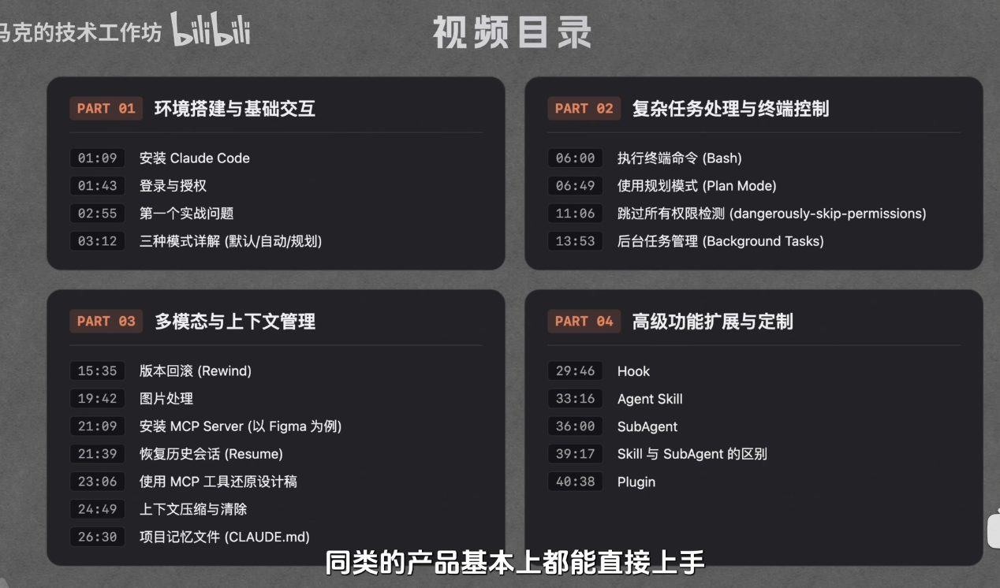
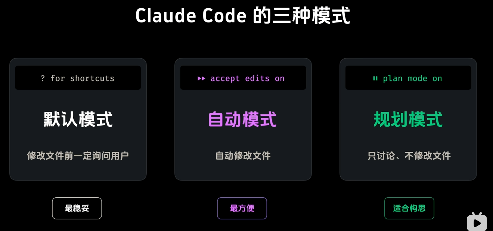

# Claude Code
其他opencode，codex可参考

[Claude Code Docs - Quick Start](https://code.claude.com/docs/en/quickstart#step-1-install-claude-code)



## 操作
```sh
#下载，参考quickstart
curl -fsSL https://claude.ai/install.sh | bash

# 创建生成目录
mkdir my-todo
cd my-todo
# 启动，可登录或者配置认证
claud
# 选择claude code默认模式
# 直接预览生成的文件
open index.html
将当前代办应用重构为使用React+Typescript+vite项目
保留当前代办应用的功能，且ui风格保持一致
#切换为accept edits on模式
# 慎用，会直接修改文件，不会确认
# 模式会变为bypass permissions on
claude --dangerously-skip-permissions
ctrl + b #放置服务在后台
? #查看帮助
/task #可查看所有服务
/rewind # 可回滚到上一个版本，也可以两次ESC选择回滚点
#写网页可以传入相应图片，让claude code根据图片生成代码
#如果想要更精确的设计可以使用MCP
/resume # 且换到上一次对话
claude -c #重启claude，并恢复上一次对话
/mcp #查看所安装的mcp工具
修改当前页面并与figma稿件一致<figma链接>
#压缩上下文，可以提示保留哪些需求
#可减少token使用量
/compact 重点保留用户需求
/clear # 清空上下文内容
/init # 创建claude.md文件
/memory # 打开claude.md文件，选择两种claudecode文件，一个是项目的claudecode，一个是用户的claudecode 文件目录~/.claude/CLAUDE.md
/hooks # 配置执行前后的回调函数
new hook # 创建一个新的hook
# 示例：解析claudecode返回的json文件配置到hook内
# 需求：生成相应的文件，用prettier格式化
jq -r '.tool_input.file_path' | xargs prettier --write
# hooks 的三种模式，Project settings(local),Project settings，User settings
# 创建skills
mkdir -p ~/.claude/skills/daily-report
code ~/.claude/skills/daily-report/
touch SKILL.md
# 默认是大模型自己检测调用skill，也可主动调用skills
/daily-report 写一份每日总结
# 创建agent
/agent # 创建一个新的agent
/plugin # 查看或安装插件
front-design
/reload-plugin # 重新加载插件和skills，可以不用claude -c重启
# 安装plugin，可能不只是安装一个插件，也可能安装skills，mcp等全部附带安装

```

## Claude Code 模式

默认模式
修改前一定询问用户

自动模式
自动修改文件

规划模式
只讨论，不修改文件


