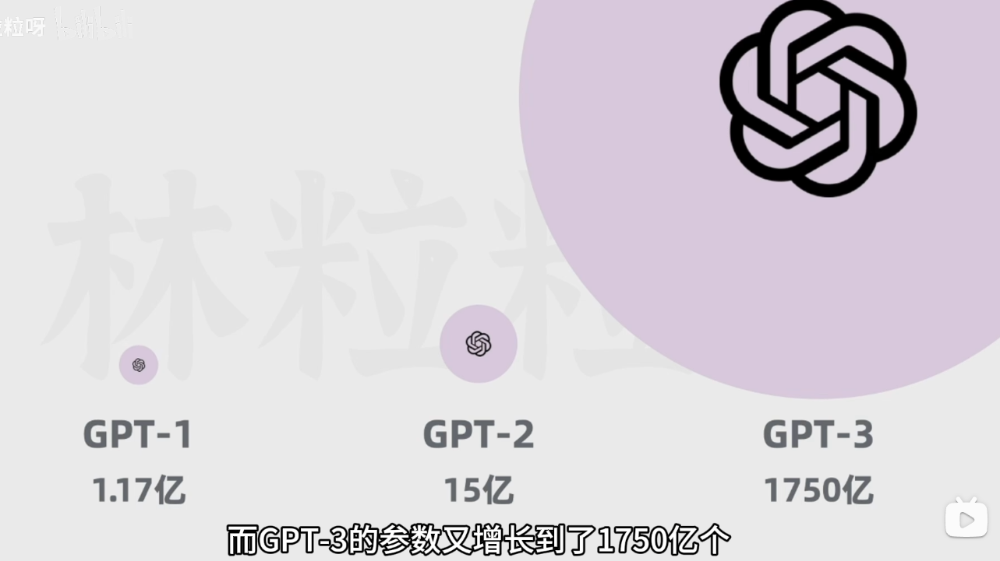
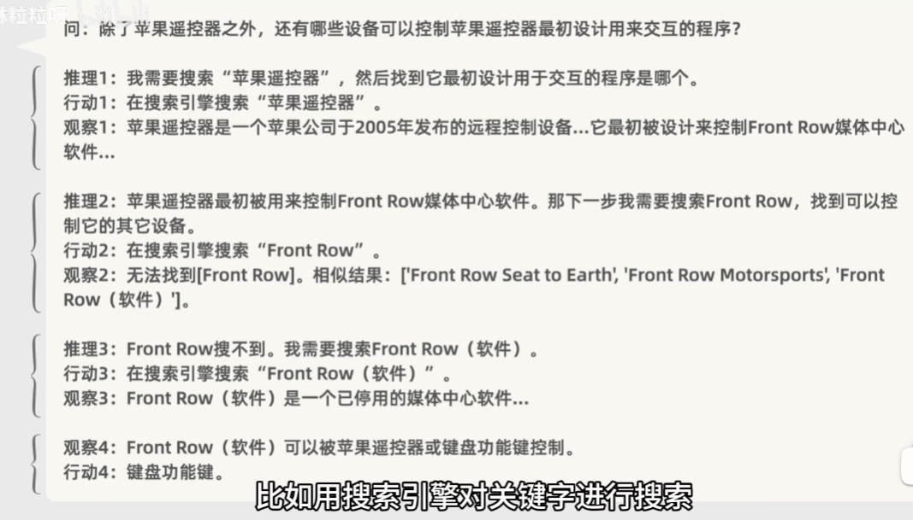

# LLM(Large Language Model)

[AI Blogs jalammar](https://jalammar.github.io/)

## 大语言模型
生成、分类、总结、改写

大量文本进行无监督学习
参数量巨大

- 传统模型

## GPT
Generative Pre-trained Transformer
生成式      预训练

## Transformer之前 传统架构

### RNN 循环神经网络
[一文搞懂RNN（循环神经网络）基础篇](https://zhuanlan.zhihu.com/p/30844905)
Recurrent Neural Network

- 每一步输出取决于先前的隐藏状态和当前输入，需要等上一个状态完成后才可以进行当前计算，无法并行计算，效率低。并且RNN不擅长处理长序列，即长文本。

- 词距离越远，前面词对后面词影响越弱，难以捕获长距离语义关系

### LSTM 长短期记忆网络
RNN改良版本

## Transformer架构

Attention Is All You Need

[The Illustrated Transformer](https://jalammar.github.io/illustrated-transformer/)

### 介绍
Transformer处理每个词时，会注意序列中所有输入的值，并给予每个词不一样的注意力权重，杈重是模型在训练过程中通过大量文本逐渐习得的

- 自注意力机制

- 位置编码

自然语言中使用序列，它表示一系列按照特定顺序排列的元素因为它表示一系列按照特定顺序排列的元素

通过词向量和位置向量给神经网络，可以进行并行计算

### 原理
[Transformer大致原理-bilibili-笔记来源](https://www.bilibili.com/video/BV1ZG411y7aZ)

input -> 词向量 + 位置编码 -> 编码器(encoder) -> 解码器(decoder)

#### input + PositionEncoding
- token化 + 向量嵌入得到词向量

- Positional Encoding 位置编码

#### 编码器
生成向量，保留了输入文本的词汇信息和顺序关系，并捕捉语法语义的关键特征，编码器可以有多个，每个之间不共享权重

##### 自注意力机制
[自注意力机制计算逻辑介绍-jalammar Githubio Blog](https://jalammar.github.io/illustrated-transformer/)

- 捕捉语法语义的关键特征

通过计算每个词之间的相关性来决定自注意力权重

##### 多头自注意力
编码器一般使用多头自注意力模块，每个头有自己的注意力权重，用来关注文本不同特征或方面。之间是并行运算

##### 前馈神经网络
会对自注意力模块的输出进一步处理，增强模型的表达能力

##### 多编码器
编码器可以有多个，每个之间不共享权重

#### 解码器
解码器不仅会把来自编玛器的输入序列的抽象表示作为输入，还会把之前已经生成的文本也作为输入，来保持输出的连贯性和上下文相关性

##### 带掩码的多头自注意力
解码器中自注意力只会关注这个词和它前面的其它词，后面的词要被遮住，不被关注。
这样做是为了确保解码器生成文本时，遵循正确的时间顺序。在预测下一个词时，只使用前面的词作为上下文。

##### 多个解码器

#### Linear 和 Softmax
它们的作用是把解码器输出的表示，转化为词汇表的概率分布。即下一个被生成token的概率。

#### 原有Transformer模型后续变种

### 如何训练chatgpt
- 第一步是通过大量的文本进行无监督学习和训练，得到一个能够生成文本的基础模型。

- 第二步是通过人工编写的高质量对话数据，对基础模型进行监督和调整，得到一个对话能力更好的修改模型。

监督微调Supervised Fine-Tuning SFT模型

- 第三步是通过问题和多个答案的数据，让人工评估者对答案进行排序，并基于这些数据训练一个可以预测答案的奖励模型。

- 可以训练另一个模型来评分，减少对人工评估者的依赖，让奖励模型学习如何预测答案的得分。

- ChatGPT是通过不断的优化策略和学习来训练的，提高了回答问题的质量。

### AI聊天助手

一、如何通过提示工程调教出一个聪明的AI聊天助手，包括小样本提示和思维链等方法，以提高沟通质量和效率。
00:01 - AI聊天助手的局限性及调教的必要性
01:08 - 小样本提示的应用及好处
02:41 - 思维链的应用及提升AI复杂推理能力的效果
二、使用思维链来提升AI回答问题的准确性。通过展示推理的中间步骤，AI可以更好地集中注意力，减少上下文干扰，从而得到更准确的结果。
03:00 - AI会模仿生成中间步骤，好处是步子小，不容易扯着
03:30 - 思维链可以减少上下文干扰，有助于复杂任务的准确结果
04:18 - 使用思维链是成本非常低的方法，可以帮助调教AI聊天助手

#### 思维链
[思维链论文_arxiv](https://arxiv.org/abs/2201.11903)

原文：[Chain-of-Thought Prompting Elicits Reasoning in Large Language Models](https://arxiv.org/pdf/2201.11903.pdf)

### chatGPT短板解决方案

#### RAG 检索增强生成
Retrieval Augmented Generation
解决大预言模型没有涉及的领域，无法给出答案。或者公司内部数据等问题。

- 把外部文档拆分为段落，再把段落转化为向量，存入向量数据库

- 用户提出问题，把问题提示转化为向量，在向量库中查询最接近的段落向量

- 段落信息会和原本的用户查询问题组合到一超

- RAG有利于搭建企业知识库或个人知识库
chatgpt官方提供上传pdf对pdf提问

#### PAL 程序辅助语言模型
Program-Aided Language Models
解决大预言模型无法精确计算问题
论文：[PAL: Program-aided Language Models](https://arxiv.org/abs/2211.10435)
[论文讲解blog-juejin](https://juejin.cn/post/7212878112455262265)

ai在涉及计算步骤时，生成得到计算结果所需代码
为了满足AI要求可以借助思维链
- 提供小样本给模型示范如何分布思考，写出解决问题所需的变量复赋值，数学运算等
- 用户提问之后，把问题和已有的提示模板进行拼接，一并给到AI，让AI生成代码
- 把AI返回的回答，给到Python解析器，执行得到精确计算结果。把结果返回给ai，并回答用户

ChatGPT的Advanced Data Analysis功能时PAL的样例，借助内置Python解析器计算出更准确的答案。

#### ReAct 推理行动结合
解决训练信息时间陈旧，无法回答时间较近的问题

[ReAct: Synergizing Reasoning and Acting in Language Models](https://arxiv.org/abs/2210.03629)
《ReActe.在语言模型中协同推理与行动》

Reason  推理    Action 行动
可以借助搜索引擎查询答案，可以和思维链结合

- 提供小样本提示，展示给模型一个推理行动的框架，针对问题进行拆分。
- 每个步骤要经过推理、行动、观察，
 - 推理：针对问题或上一步观察的思考。
 - 行动：如使用搜索引擎对关键字搜索
 - 观察：对行动结果进行查看

Action可以是代码解析器，文档，其他应用API等。可以借助**LangChain**等框架实现

[LangChain官方文档](https://www.langchain.com.cn/getting_started/getting_started)

ChatGPT的Web Browsing功能，就是通过与Bing搜索交互的能力，从而回答实时信息

