# WebRTC

https://www.bilibili.com/video/BV1D14y1W7qp

## WebRTC框架

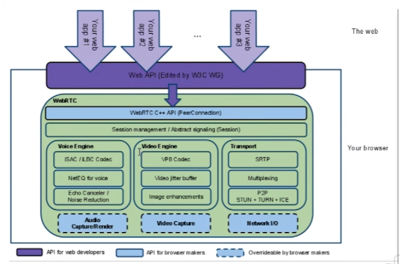

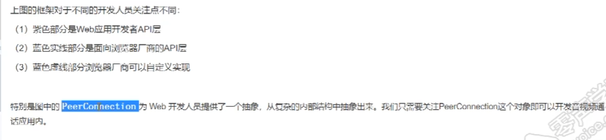

### WebRTC通话原理1--STUN

Session Traversal Utilities for NAT
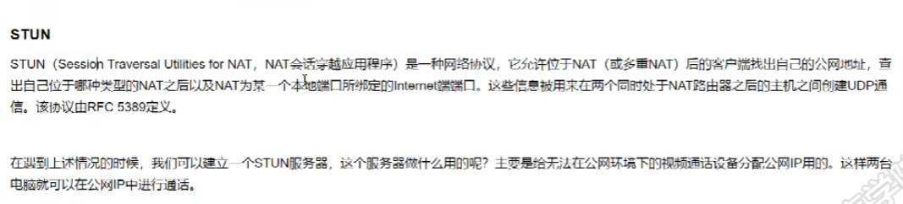

#### 媒体协商

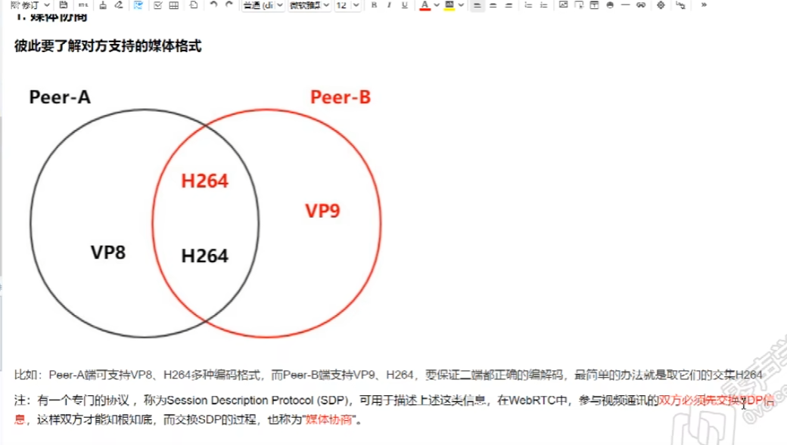

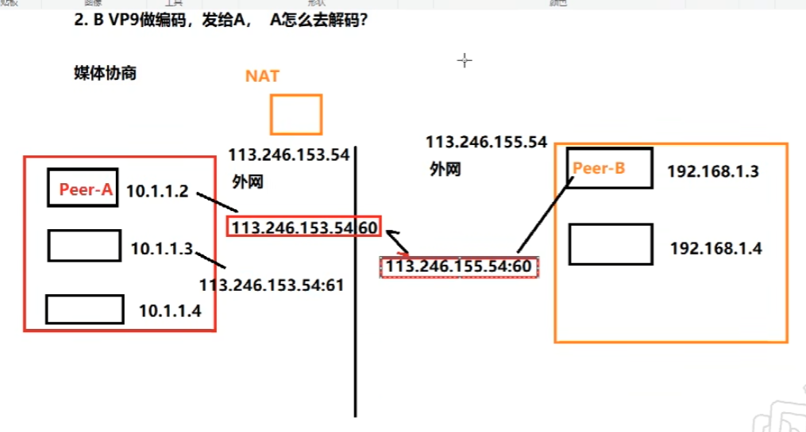

### WebRTC通话原理2--TURN

Traversal Using Relays around NAT
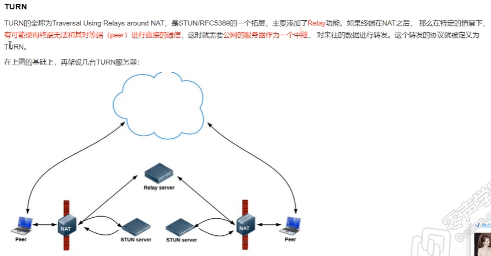

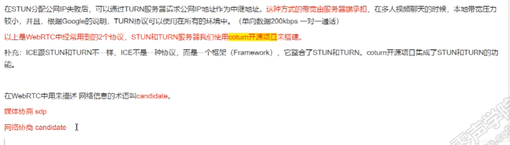

### 媒体协商+网络协商数据的交换通道

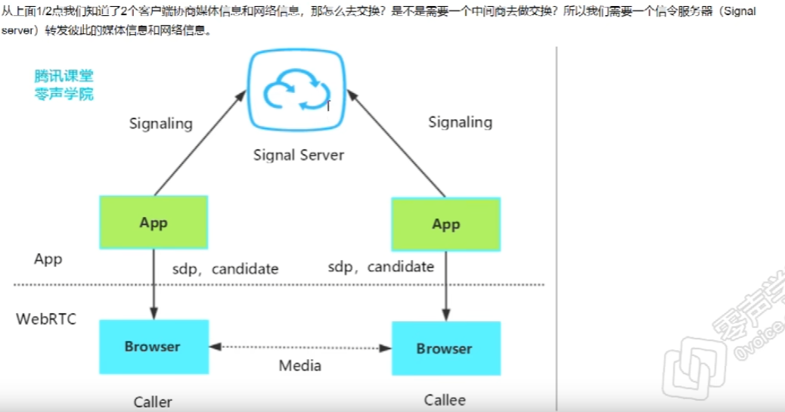

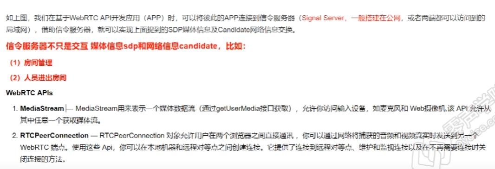

### 收获

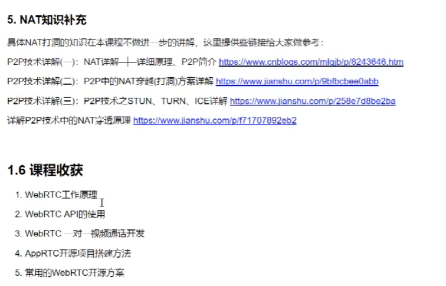

## coturn穿透和转发服务器

**ubuntu**

```shell
sudo apt-get install libssl-dev
sudo apt-get install libevent-dev
```

**centos**

```shell
sudo yum install openssl-devel
sudo yum install libevent-devel
```

### 编译coturn

```shell
git clone <coturn github 地址>
cd coturn
./configure
make
sudo make install
```

### 验证是否安装成功

```shell
# nohup是重定向命令，输出都将附加到当前目录的nohup.out文件中，命令后加&，后台执行起来后按ctrl+c，不会停止
sudo nohup turnserver -L 0.0.0.0 -a -u lqf:123456 -v -f -r nohup.out &
# 查看coturn默认端口是否存在进程
sudo lsof -i:3478

```

### 测试

[how-to-test-online-whether-a-stun-turn-server-is-working-properly-or-not](https://ourcodeworld.com/articles/read/1526/how-to-test-online-whether-a-stun-turn-server-is-working-properly-or-not)

1. Using TrickleICE
The first tool that you can use to test if your STUN/TURN server is working, is the Trickle ICE tool from the official samples of [the WebRTC repository at Github](https://github.com/webrtc/samples/tree/gh-pages/src/content/peerconnection/trickle-ice). You can test [the online tool on this website](https://webrtc.github.io/samples/src/content/peerconnection/trickle-ice/):

2.  Using ICE Test
The other alternative to Trickle ICE is the [ICE Test website that you can visit here](https://icetest.info/) or [the source code at Github here](https://github.com/tgabi333/ice-test). It works basically in the same way, you can create your own list of ICE servers providing the STUN/TURN URI and credentials if necessary to test them:

3. Using your own JavaScript
```javascript
const iceServers = [
    // Test some STUN server
    {
        urls: 'stun:mydomain.com:port?transport=udp'
    },
    // Test some TURN server
    {
        urls: 'turn:mydomain.com:port?transport=udp', 
        username: 'username', 
        credential: 'password'
    }
];

const pc = new RTCPeerConnection({
	iceServers
});

pc.onicecandidate = (e) => {
    if (!e.candidate) return;

    // Display candidate string e.g
    // candidate:842163049 1 udp 1677729535 XXX.XXX.XX.XXXX 58481 typ srflx raddr 0.0.0.0 rport 0 generation 0 ufrag sXP5 network-cost 999
    console.log(e.candidate.candidate);

    // If a srflx candidate was found, notify that the STUN server works!
    if(e.candidate.type == "srflx"){
        console.log("The STUN server is reachable!");
        console.log(`   Your Public IP Address is: ${e.candidate.address}`);
    }

    // If a relay candidate was found, notify that the TURN server works!
    if(e.candidate.type == "relay"){
        console.log("The TURN server is reachable !");
    }
};

// Log errors:
// Remember that in most of the cases, even if its working, you will find a STUN host lookup received error
// Chrome tried to look up the IPv6 DNS record for server and got an error in that process. However, it may still be accessible through the IPv4 address
pc.onicecandidateerror = (e) => {
    console.error(e);
};

pc.createDataChannel('ourcodeworld-rocks');
pc.createOffer().then(offer => pc.setLocalDescription(offer));
```


```shell
sudo tail -f nohup.out

```

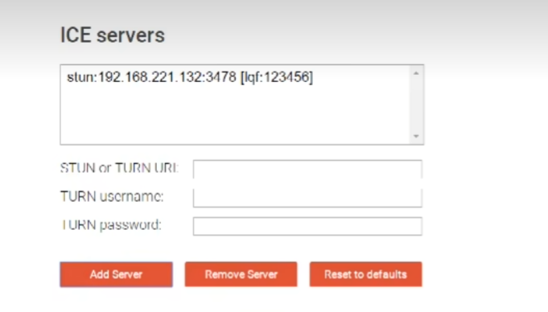
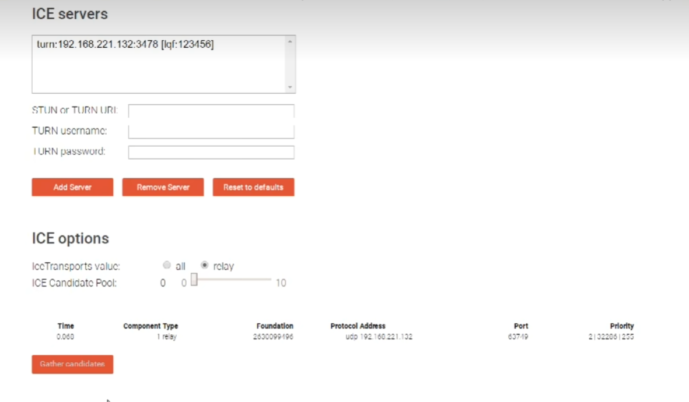


## 视频开发

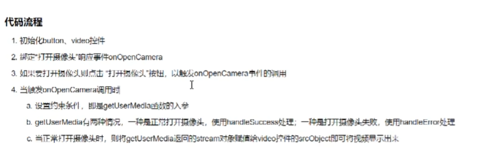

[getUserMedia API开发](https://developer.mozilla.org/en-US/docs/Web/API/MediaDevices/getUserMedia)


## websocket
```shell
npm init -y
npm i ws
```

