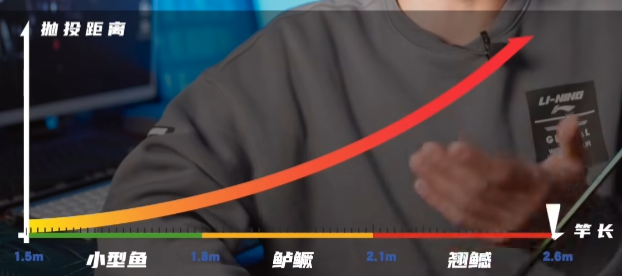
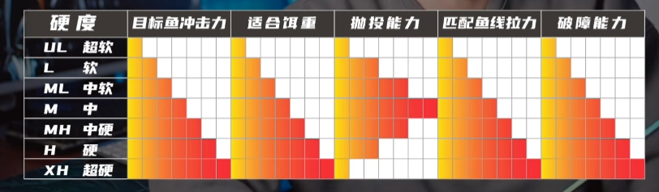
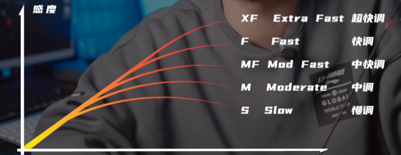
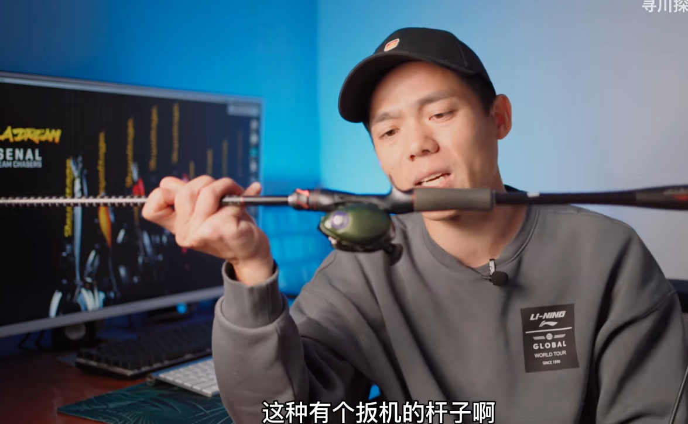
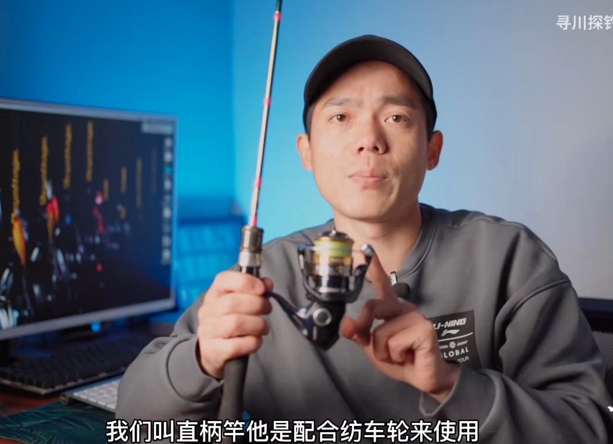
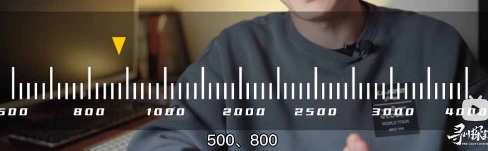

路亚钳
学习打结教程
3-5克的亮片鱼饵
2.5 3.5的铅头勾
3/5g的VIB
N-S单肩包

# 路亚入门的第一支路亚竿

[路亚入门的第一支路亚竿](https://www.bilibili.com/video/BV1CK4y1L7aS/s)

## 抛投距离

2.1-2.2

## 硬度

泛用杆 M

## 调性
MF 中快

如果专注于鲈鳜等近距离精细作钓，你甚至可以选快调，或者是超快调

## QA：直柄杆配纺车轮还是枪柄杆配水滴轮

### 枪柄杆
这种有个扳机的杆子是枪柄杆，然后他是配合水滴跟鼓轮使用

- 特点：
专业气质
各种抛投各种秀

### 直柄杆
没有扳机的杆子是直柄杆，一般配合是配合纺车轮来使用

- 特点
大小饵通吃
白天黑夜都管用

- 注意：直柄竿和枪柄竿一般是不能通用的啊

### 预算选杆
你想有一个好的体验，同时又想追求那么一点品牌的知名度

#### 500元以内的套装
基本只有直柄纺车轮的组合

- 直柄纺车轮
杆子呢可以选择：
daiwa（达瓦）的crossfire
禧玛诺的majestic

- 枪柄竿
基本上很难找到性价比相对好一点的
因为一款性能相对凑合的水滴轮，就会占掉你很大部分的预算

#### 1000元预算
可以选择daiwa，bassx或者是一些好的国产品牌，比如领峰lurefans的产品
同时呢也有一些合适价位的水滴轮

### 推荐建议
禧玛诺塞纳 + 喜玛诺马杰士S610ML-2

我也借花献佛给新手点建议吧，新手千万别买打着双竿稍广告的杆子！！套装的话良心商家配的哪怕塑料的纺车套，如果是浅杯其实一般山涧溪流小河道玩玩微物还是不错的，作为学生党来说一两百的预算还行，但这种往往需要有点门槛的线来配合，一般的线径直逼2.0的大力马PE体验感会相当差，如果线预算不多微物纺车可以用0.6-1.0尼龙/0.8-1.2碳线直接当主线用，多障碍的溪流除外，新手非常容易挂障碍，这两个线有延伸线，饵容易回弹炸到自己，一般城市的那种围城河道这类的杆子可以选L硬度的中快，小鱼有点手感，中斤货也不虚，如果肯定只有小鱼或者只玩瓜子亮片的话可以买UL，数值参考UP主的视频，纺车用的直柄UL建议1.68-1.89之间，短的1.35-1.68而且还是廉价杆的话1-3克的小饵实在是不好抛投，等熟练以后可以换个1.35-1.5的玻纤找个障碍多的地方练抛投技术，最后就是纺车上手快，精通难，水滴入门难，精通容易纺车要玩得精准玩的花要花好久，水滴一般没经验的新手如果买的轮子有一定门槛，一两个月下来，基本水域都能做到精准抛投，就像UP主说的，喜欢帅（预算相对大）就水滴，预算有限实用性就选纺车

禧玛诺新出的一三款SLXDC
体积比较大，重量比较重一点，外观设计比较敦实，
DC电子刹车，它抛投的时候会发出声音
它的抛投距离，相对于达亿瓦同价位的轮子来讲，抛投距离会有一一定的局限性
但是它更加的稳定

但是达亿瓦它的远投性能强

基本上就是达亿瓦的火蜥蜴或者是蜘蛛系
你到手的感觉就是它
外形看起来比较小巧，感觉上它的设计整体就是比较轻盈一点，但是达亿瓦它的远投性能强，它的稳定性是不如DC系列的轮子的

# 入门的第一个路亚轮

纺车轮、水滴轮、鼓轮

新手入门主要是纺车轮和水滴轮

## 纺车轮

### 优点
1. 他的抛投非常容易上手，基本不存在炸线放枪，这些水滴轮上面经常出现的问题
2. 性价比非常高，500以内可以选择很多国际一线品牌，型号非常多样

### 型号
型号就是我们经常在，纺车轮线杯上面能看到的这些数字

淡水路亚中啊经常使用的型号有以下：

数字越大，他的体积跟重量也就相应的越大

选择型号的时候，一定是以当地的对象鱼作为参考的，

- 以常规体型的对象鱼就是，我们经常钓的这种两三斤的鱼，这种作为标准的话，可以选择1000-2000

- 马口、青稍、红眼这种小体型的鱼，可以选择500-800的小轮子

- 大体型的鱼可以选择2500

- 不建议选择更大型号的纺车轮，虽然说他的容线量增大，但是重量和体积也会直线上升，那使用起来的舒适度就会大大下降

### 刹车力
刹车力就是在博鱼的时候，轮子内部刹车片，提供的一个反向摩擦力，用于抵消鱼的拉力

最大刹车力，纺车轮三公斤到十几公斤都有，在型号合适的情况下

### 线杯深浅

### 重量

