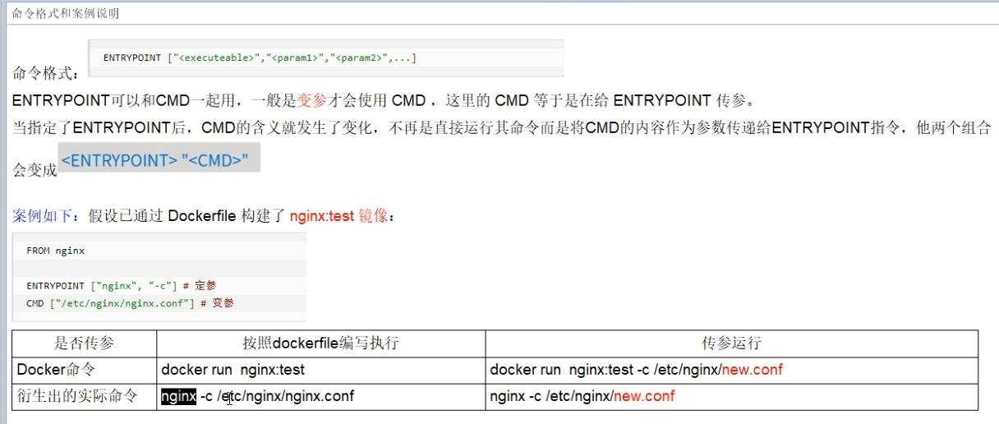
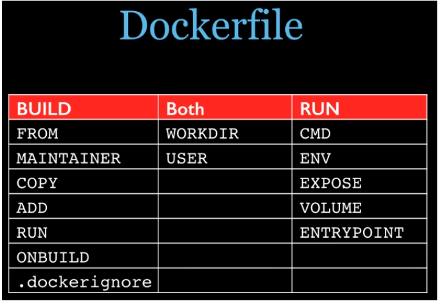
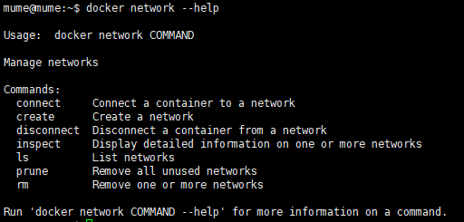
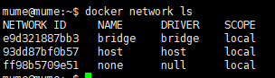
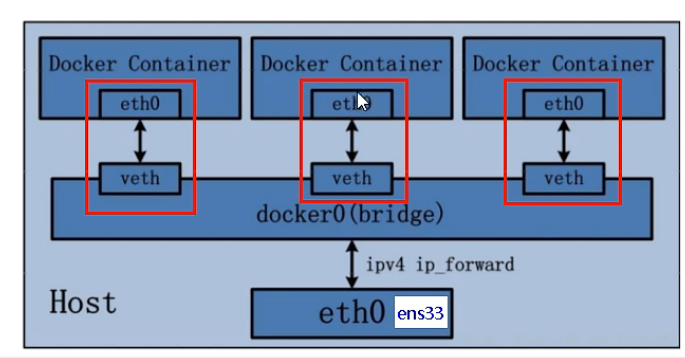
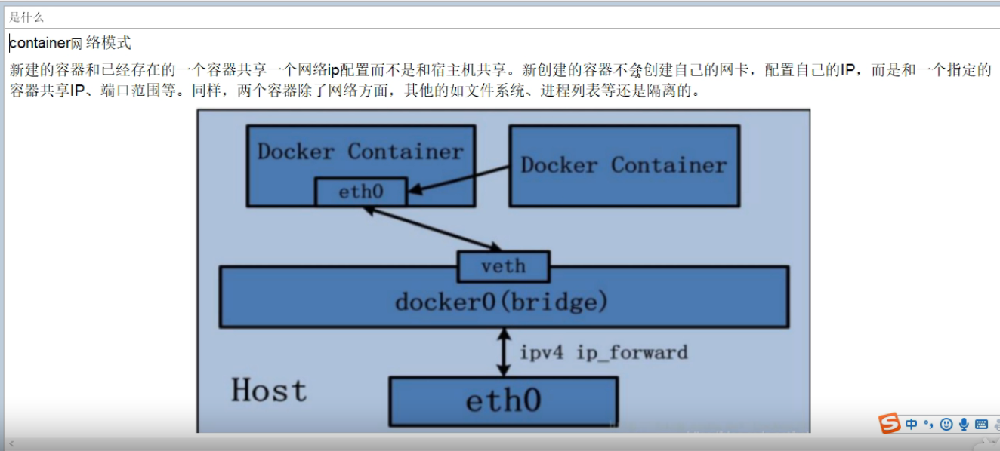
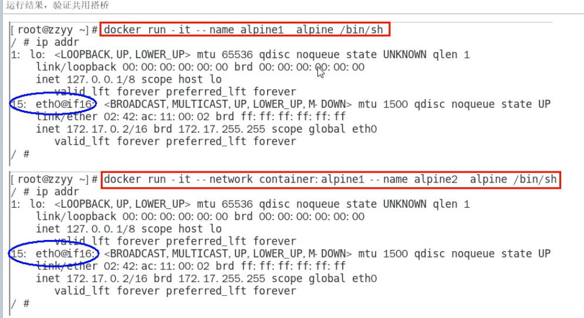
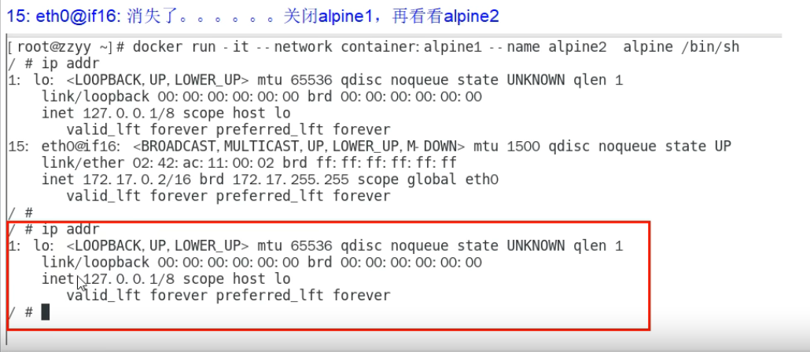
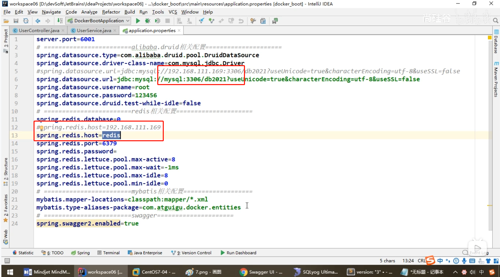
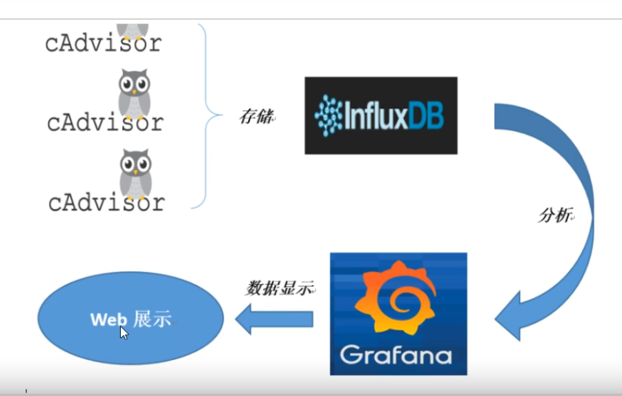

# Docker

## tips

###### 尚硅谷阳哥邮箱

zzyybs@126.com

###### docker 用非root用户执行命令报错

[docker 权限问题 Got permission denied解决方案](https://blog.csdn.net/m0_54861649/article/details/123870145)

```shell
sudo groupadd docker #添加docker用户组

sudo gpasswd -a $USER docker #将登陆用户加入到docker用户组中

newgrp docker #更新用户组
```

## docker 命令

```shell
docker search <key>
docker pull <image>
docker images
docker ps <container id>
    -a 所有包含没启动的
    -q 
docker run -it <image id>
    -d 使用守护线程运行，只有当和主机有端口映射时，才会启动
        # 输入exit 容器直接停止
        # ctrl+p+q 第一次启动，使用该快捷键退出不会使容器停止
	--restart=always

# **容器命令**

docker exec -it <container id>

# 应用开机自启
docker update <container id> --restart=always


# 查看容器配置
docker inspect <container id>
# 查看容器执行日志
docker logs <container id>

# 查看镜像、容器、卷、缓存等数量
docker system df# 查看镜像、容器、卷、缓存等数量
docker system df

```

## docker 安装mysql8.0

```shell
docker run -p 3307:3306 --name mysql-master 
-v /data/mysql/conf:/etc/mysql/conf.d 
-v /data/mysql/log:/logs
-v /data/mysql/data:/var/lib/mysql 
-e MYSQL_ROOT_PASSWORD=root -d mysql:8.0


docker run -p 13306:3306 --name mysql-master 
-v /mydata/mysql-master/log:/var/log/mysql 
-v /mydata/mysql-master/data:/var/lib/mysql 
-v /mydata/mysql-master/conf:/etc/mysql/conf.d 
-e MYSQL_ROOT_PASSWORD=123456 -d mysql:8.0
```

## Dockerfile 命令

[Dockerfile官方文档](https://docs.docker.com/engine/reference/builder/)

```Dockerfile
# 只用于FROM之前，可以设置镜像版本或者其他任何命令
ARG
ARG CODE_VERSION=latest
FROM base:${CODE_VERSION}
# 基础镜像
FROM [--platform=<platform>] <image> [AS <name>]
# 作者
MAINTAINER joker
# docker build执行的命令
RUN yum -y install vim
# 暴露的端口号
EXPOSE 8080
# docker run第一次进入的工作目录
WORKDIR /usr/local
# 指定该镜像以什么样的用户去执行，如果都不指定，默认是root
USER mume
# 环境变量
ENV MY_PATH /usr/mytest
# 和COPY类似，把主机的文件复制到容器中，ADD同时会解压tar压缩包
ADD src(.tar.gz) dest
# 把主机的文件复制到容器中
COPY src dest
# 定义容器卷
VOLUME
# Dockerfile 中可以有多个 CMD 指令，但只有最后一个生效，CMD 会被 docker run 之后的参数替换
CMD
# 类似于 CMD 指令，但是ENTRYPOINT不会被docker run后面的命令覆盖，
#而且这些命令行参数会被当作参数送给 ENTRYPOINT 指令指定的程序
ENTRYPOINT
```

**nginx中的ENTRYPOINT,CMD使用实例**

**Dockerfile命令汇总**


## docker微服务实战

1. idea等开发工具新建java微服务项目
2. 打成jar包，把jar包传入服务器
3. 编写Dockerfile文件(jar包和Dockerfile最好处于同一文件夹下)

```Dockerfile
# 基础镜像使用java
FROM java:8
# 作者
MAINTAINER zzyy
# VOLUME 指定临时文件目录为/tmp，在主机/var/lib/docker目录下创建了一个临时文件并链接到容器的/tmp
VOLUME /tmp
# 将jar包添加到容器中并更名为zzyy_docker.jar
ADD docker_boot-0.0.1-SNAPSHOT.jar zzyy_docker.jar
# 运行jar包
RUN bash -c 'touch /zzyy_docker.jar'
ENTRYPOINT ["java","-jar","/zzyy_docker.jar"]
#暴露6001端口作为微服务
EXPOSE 6001 
```

## docker network

### docker 网络命令

- linux网络命令

```shell
ifconfig
ip addr
```

docker启动后，网络中会新建一个docker0网络

```shell
docker network --help
docker network ls
docker network create <network name>
docker network rm <network name>
docker network inspect <network name>
```





### docker网络

1. 作用

- 保证容器间的互联和通信以及端口映射
- 容器IP变动的时候可以通过服务名直接网络通信而不受影响

2. 模式
   docker容器内部ip可能发生变化

-- network <模式>

- bridge模式
  docker0上面的每一个veth匹配某个容器实例内部eth0，两两配对，一一匹配
  
- host模式
  使用主机的ip，docker run时不用使用-p指定端口
- none模式
- container模式：--network container:<NAME/container id>







- 自定义网络模式

```shell
docker network create <network name>
```

## docker-compose

**docker-compose还是存在一些缺陷，可以使用k8s**

- Compose允许用户通过一个单独的docker-compose.yml来定义一组关联的应用容器为一个项目（project）。
- Docker-comppose解决了容器与容器之间的编排问题

### 要素

- 服务：redis,mysql,微服务等
- 工程：一组关联的应用容器组成一个完整业务单元，docker-compose.xml

### docker-compose 命令

```shell
docker-compose
    -h          # 查看帮助
    up          # 启动所有docker-compose服务
    up -d       # 启动所有docker-compose服务并后台运行
    down        # 停止并删除容器网络
    exec <yml的服务id>  # 进入容器实例内部docker-compose exec docker-compose.yml文件中写的服务id /bin/bash
    ps          # 展示当前docker-compose编排过的运行的所有容器
    top         # 展示当前docker-compose编排过的容器进程

    logs <yml里面的服务id>  # 查看容器输出日志
    config      # 检查设置
    config -q   # 检查设置，有问题才输出
    restart     # 重启服务
    start       # 启动服务
    stop        # 停止服务
```

### docker-compose.yml

```yml
# 版本
version: "3" 
services:
    # docker run -d -p 6001:6001 -v /app/microService:/data --network atguigu_net --name ms01 zzyy_docker:1.6
	microService:
		image: zzyy_docker:1.6
		container_name: ms01
		ports:
			- "6001:6001"
		volumes:
			- /app/microService:/data
		networks:
			- atguigu_net
		depends_on:
			- redis
			- mysql
	redis:
		image: redis:6.0.8
		ports:
			- "6379:6379"
		volumes:
			- /app/redis/redis.conf:/etc/redis/redis.conf
			- /app/redis/data:/data
		networks:
			- atguigu_net
		command: redis-server /etc/redis/redis.conf
	
	mysql:
		image: mysql:5.7
		environment:
			MYSQL_ROOT_PASSWORD: '123456'
			MYSQL_ALLOW_EMPTY_PASSWORD: 'no'
			MYSQL_DATABASE: 'db2021'
			MYSQL_USER: 'zzyy'
			MYSQL_PASSWORD: 'zzyy123'
		ports:
			- "3306:3306"
		volumes:
			- /app/mysql/db:/var/lib/mysql
			- /app/mysql/conf/my.cnf:/etc/my.cnf
			- /app/mysql/init:/docker-entrypoint-initdb.d
		networks:
			- atguigu_net
		command: --default-authentication-plugin=mysql_native_password #解决外部无法访问 
networks:
	atguigu_net:
```

**如果使用docker部署springboot项目，由于docker中的ip可能发生变化，所以springboot不能使用ip配置，而应当使用服务名代替**



### docker-compose部署

```shell
docker compose up -d
```

## Portainer.io

图形化docker管理工具

## docker容器监控

建议学k8s替换
CAdvisor监控收集 + InfluxDB存储数据 + Granfana展示图表


