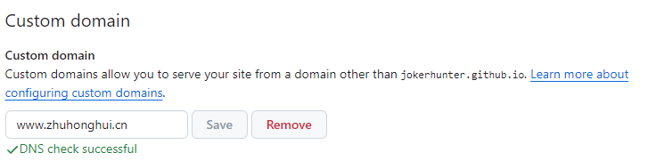

# 云笔记实现方式

## vuepress系列
vuepress + Github Actiion + Github Pages

### vuepress
[vuepress官网-快速开始](https://vuepress.vuejs.org/zh/guide/)

[vuepress-pdf-plugin](https://juejin.cn/s/vuepress-plugin-pdf-export)
[插件教程](https://xhhdd.cc/index.php/archives/80/)

### vuepress-vdoing
vuepress + Github Action + Github Pages
[vuepress-vdoing](https://lanyinemt.github.io/pages/52d5c3/)

## Docsify
方案：**Docsify + Github Pages**
支持原生Markdown

docsify 可以快速帮你生成文档网站。不同于 GitBook、Hexo 的地方是它不会生成静态的 .html 文件，所有转换工作都是在运行时。如果你想要开始使用它，只需要创建一个 index.html 就可以开始编写文档并直接部署在 GitHub Pages。

[Docsify官网-快速开始](https://docsify.js.org/#/zh-cn/quickstart)

[Docsify官网-插件](https://docsify.js.org/#/awesome?id=plugins)

## others
Gitbook

### Hexo
静态页面编辑
[Hexo官网](https://hexo.io/zh-cn/index.html)

### 可以动态撰写页面
WordPress 或 Typecho  可以直接在浏览器撰写发布，需要用到数据库

typora+github+readthedocs/ghp就可

## GitHub Pages
[Github Pages官方文档-快速入门](https://docs.github.com/zh/pages/getting-started-with-github-pages/about-github-pages)

[GitHub Pages](https://zhuanlan.zhihu.com/p/183977963)
[Blog](https://blog.mikelyou.com/2020/07/22/github-pages-project-sites/)

## 添加云平台CName和github custom domain name
domain name(域名)
[华为云添加域名对应CName](https://support.huaweicloud.com/usermanual-dns/dns_usermanual_0010.html)

github pages 添加对应custom domain

