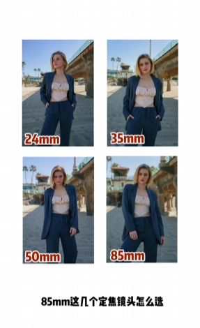
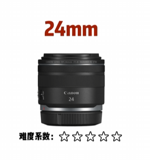
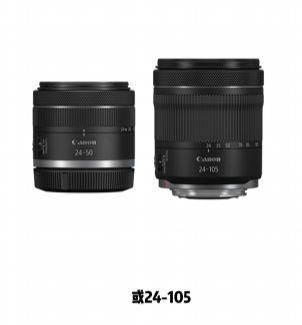
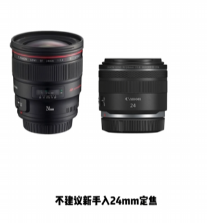
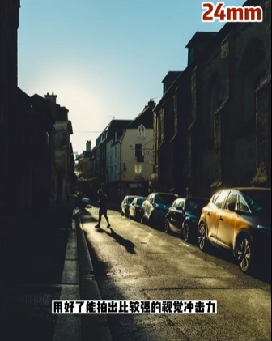
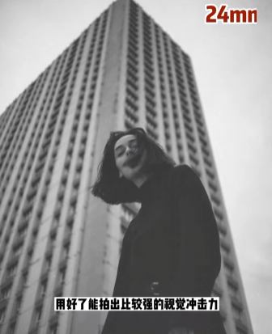
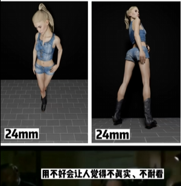
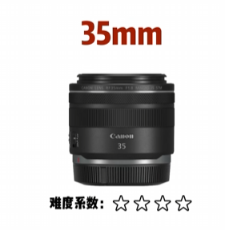
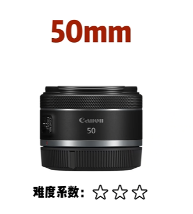
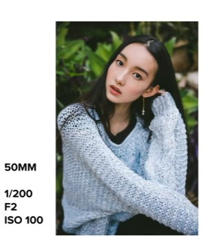

# 认识焦距📷24mm、35mm、50mm、85mm怎么选

## 24mm定焦

如果拍摄风景为主、且追求性价比，推荐24-50，或24-105，不建议新手入24mm定焦,因为24定焦贵且上手难度大，用好了能拍出比较强的视觉冲击力，用不好会让人觉得不真实、不耐看  

- 24定焦实图

## 35mm
35mm定焦，适合拍摄室内人像，与50mm定焦，都是比较符合人眼视角的焦距。

- 拍摄图示

- 相对干长焦镜头，拍摄的人像会真实平庸，需要通过不同视觉、构图去突破
适合有一定基础想进阶的朋友

## 50mm
性价比高，适合拍人像为主的新手

## 85mm
拍摄人像的黄金焦段，能拍出更好着的人物比例，拍摄时尽量缩小1到2档光圈，能拍出更完美的效果

