# 摄影

## 学习参考地址

[伍伍摄影7芊版](https://www.bilibili.com/video/BV12j411477m)

## 【光圈、快门、感光度】曝光三要素

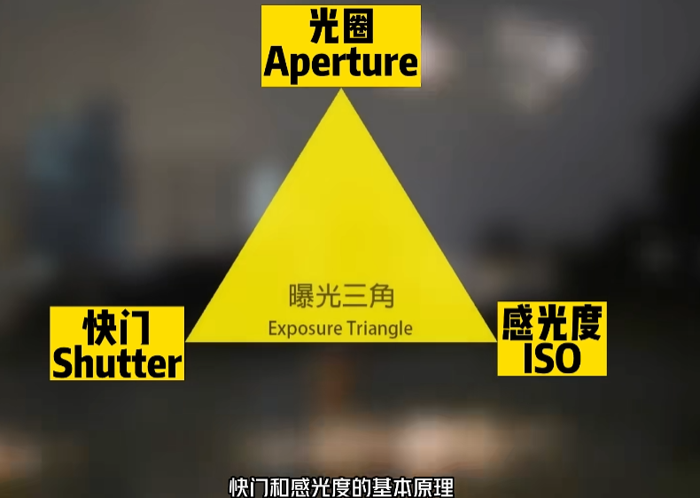

### 光圈Aperture

#### 光圈概念 = 相机镜头的瞳孔大小

每一个镜头都会有一个孔径，而光线会通过孔径进入相机，孔径的大小控制进光量的多少

孔径大=进光量多
孔径小=进光量少
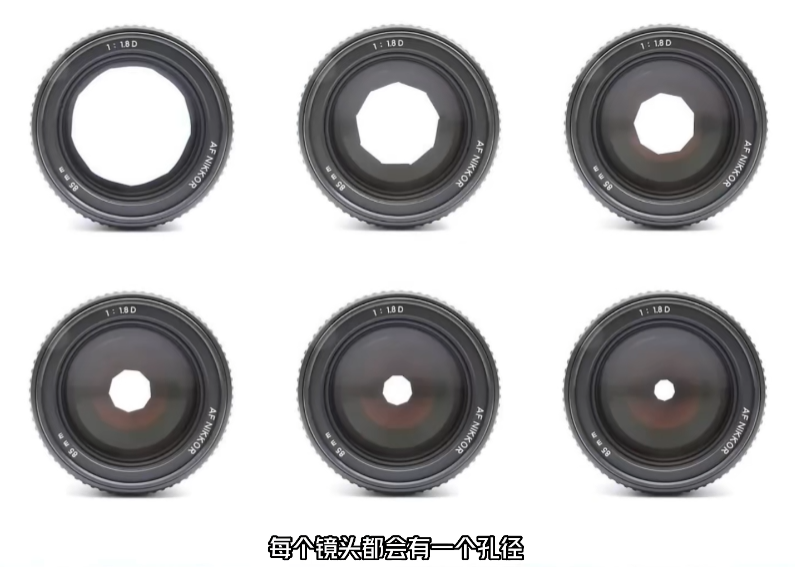

- 进光量

进光量的多少会影响
1、景深
2、曝光
3、镜头成像质量

光圈是F除以数值来表示
F/1.8  F/2.8  F/4  F/5.6  F/8  F/11
数值越小，光圈越大
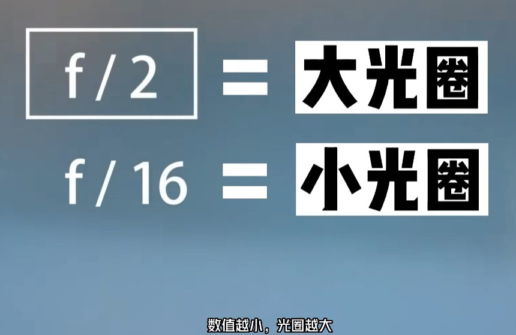
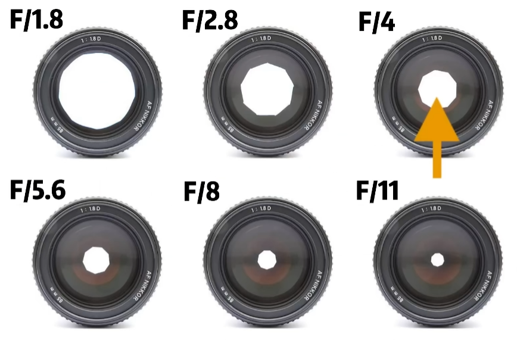

- 什么是一级光圈

F/4 提高一级光圈就是F/2.8，曝光量提升一级
分母越大，光圈越小

光圈较大，进光量较多；光圈较小，进光量较少；

#### 大小光圈区别

##### 大光圈
F2.8的光圈比F16的进光量更多，
- 大光圈可以做到浅景深的效果
- 可以清晰地突出主体，如人像摄影，突出一个静物等
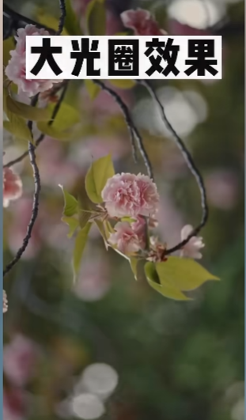

##### 小光圈
当我们需要前后物体都要清晰的时候，如风景，集体大合照，就需要用到小光圈拍摄
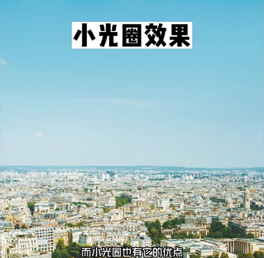

### 快门Shutter

#### 快门帘
其实相机上面有一扇快门帘，打开快门帘时，光线会进入，照射感光元件，从而产生影像

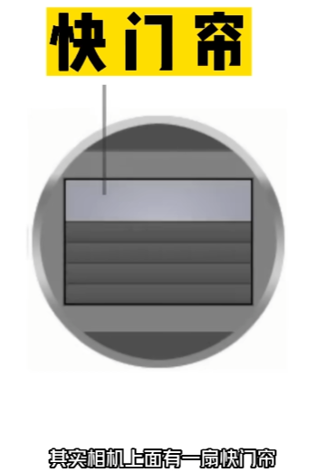

而快门速度就是快门帘打开的速度，是快门控制光持续的时间
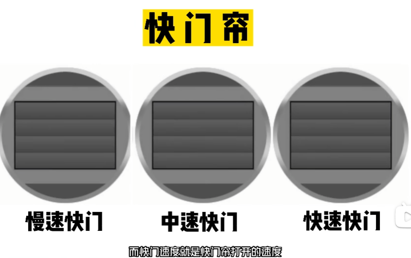

#### 安全快门

快门曝光时间长，进光量就会越多；但由于在持续曝光，很容易产生手抖而让画面模糊，可以通过安全快门来维持画面清晰

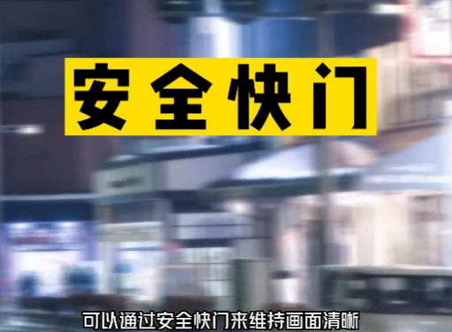

安全快门一般是1除以焦距，如，使用85毫米的镜头时，安全快门就是1/85秒
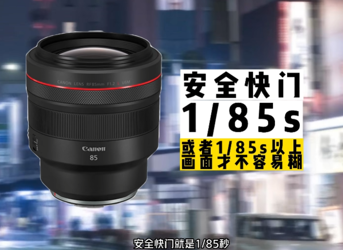

#### 高速快门
另外想要拍摄动感，一刹那的画面，可以使用高速快门，如1/1000秒

适合拍摄水花、体育摄影等等
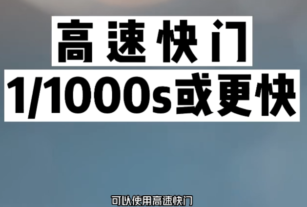

### 感光度ISO
