# 支付业务

## 账户
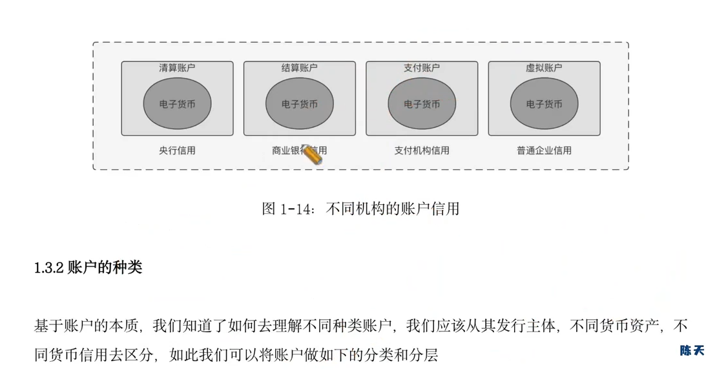
实时清算，定时结算

直连账户：
      人行
        ⬇
商 -> 网联 -> 银行

### 人行清算账户
现在准备金和备用金合并为准备金，可以进行超额
- 准备金 12.5%左右
抗风险
- 备付金
银行备付金、三方备付金

### 银行结算账户
个人结算账户
企业结算账户

### 支付账户
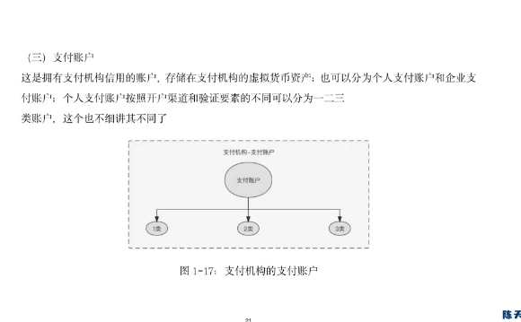

### 企业虚拟账户
红包，券，卡

# 支付工具
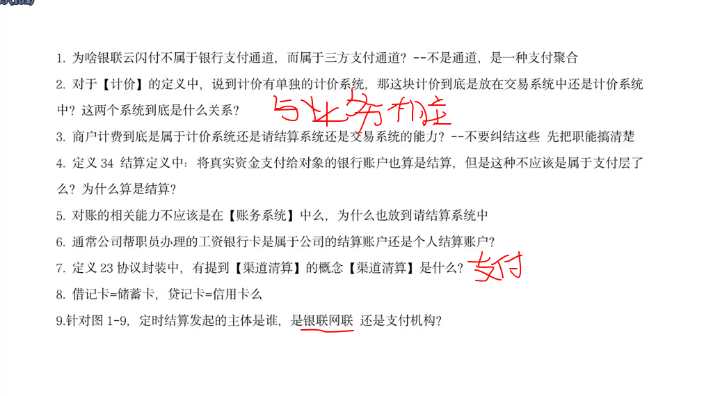

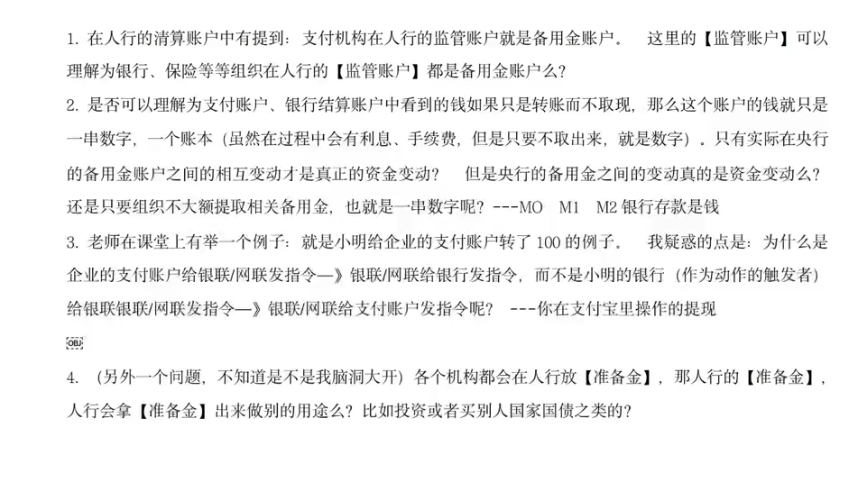

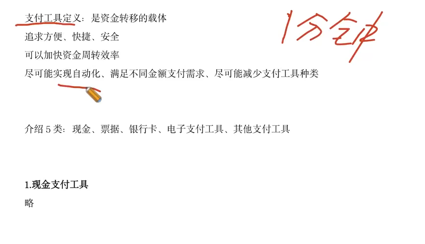

# 支付设计相应会计基础
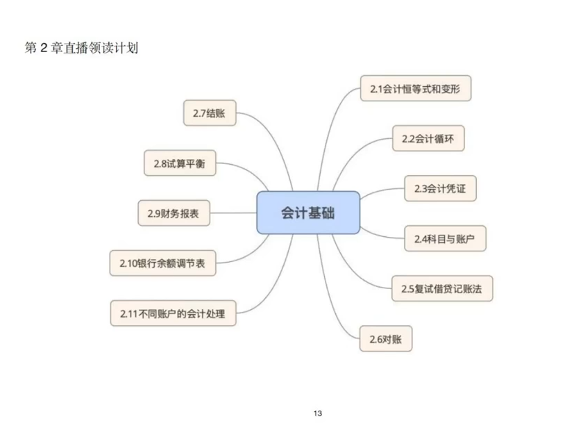

## 会计恒等式
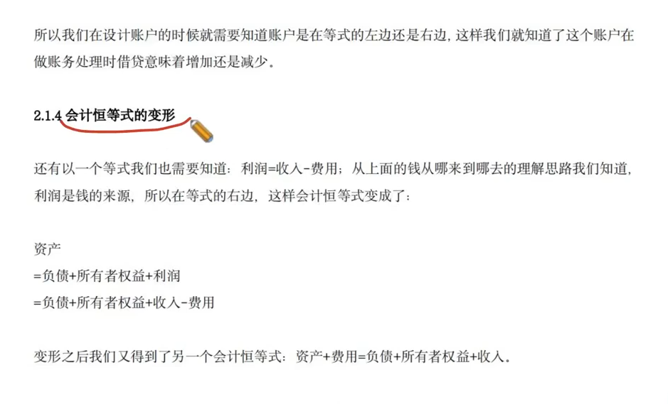

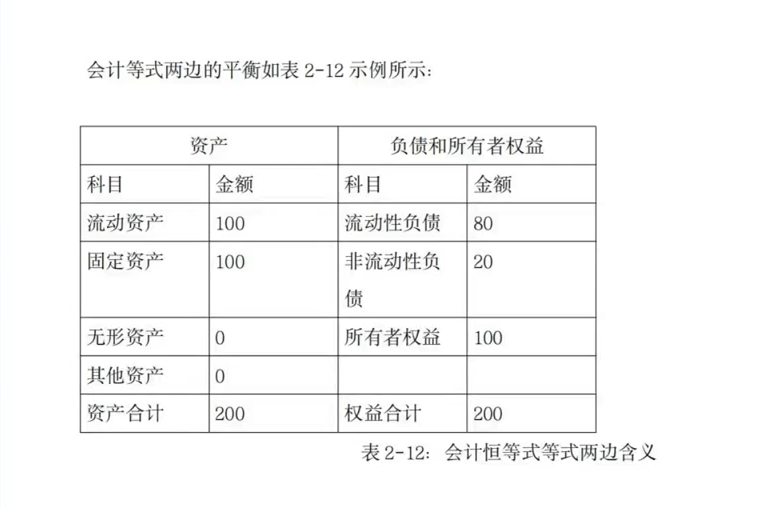

## 会计科目
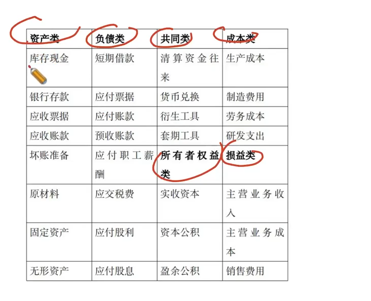

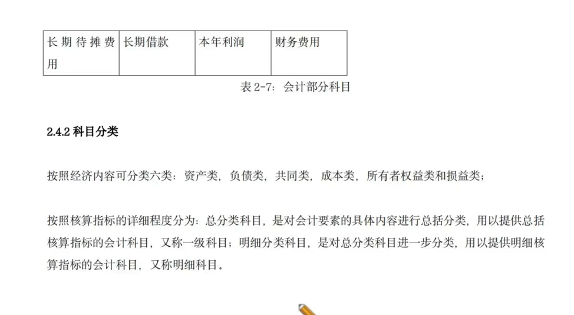

## 复试借贷记账法

#### 记账方法分类

## 对账

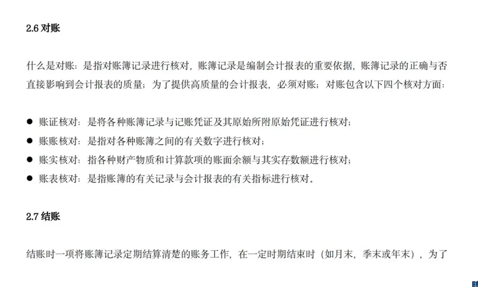

## 结账

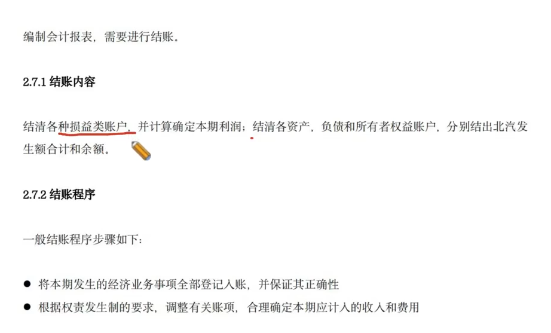

## 试算平衡
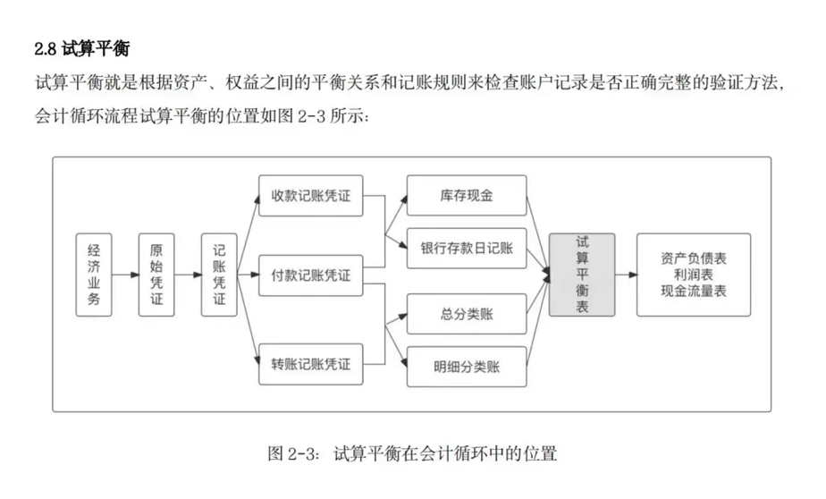

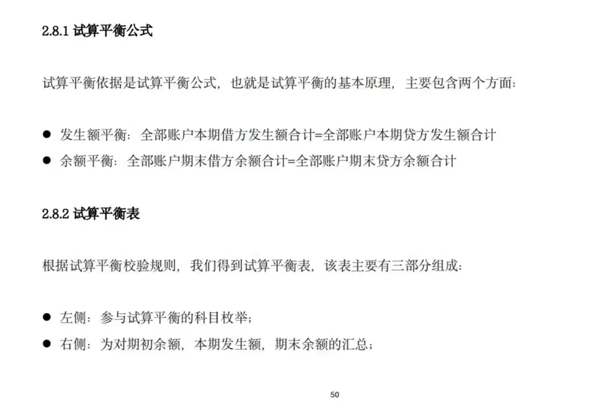

## 银行余额调节表

