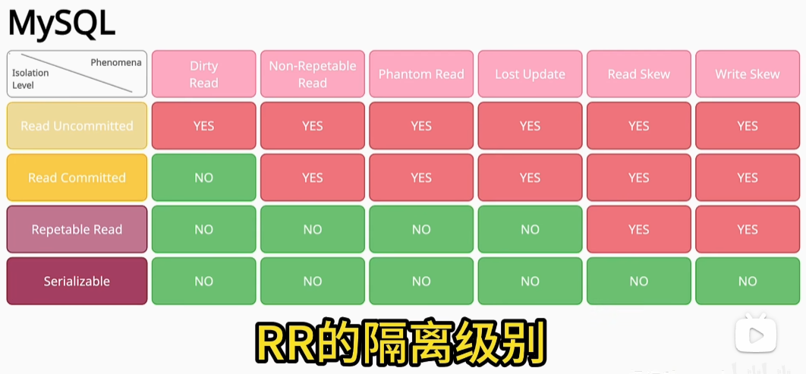

# Mysql

## 事务隔离级别

Mysql默认是RR，可重复读

一般很多会设置RC级别，读已提交，可以避免间隙锁产生，可以提升高并发写的效率

InnoDB在可重复读前提下可以解决幻读问题吗? 极端情况无法解决

## 对数据库连接数进行优化
类比java线程池的线程数设置，一般不会修改连接数

把日志写入从随机变为顺序写

把每次事务的持久化变为批量事务持久化

设置缓冲区大小
- 索引缓冲区
- 表的缓冲区
- 查询的缓冲区
- 排序的缓冲区

varchar char text区别
datetime timestamp 区别
主键不重复就够了，为什么主键要用递增组件，

学习不同数据类型的存储原理

## 索引失效
传入参数过长，业务层进行长度限制

explain查询执行计划，但是不够详细

MySQL 提供optimizer trace，能查询更详细的执行计划

索引覆盖，索引下推

## 架构优化
优化先尝试优化索引，在尝试加缓存，加异步化，最后才考虑分库分表
**主要考虑投入产出比**

### 分表
单表数据量比较大，索引效率太低。为了优化索引效率，进行分表

分表也不止水平分，可以周期性进行冷热分离

### 分库
并发量太大，导致数据库连接数不够用，从而进行分库

分库不止可以水平分，也可以读写分离，但要考虑主从延迟带来的业务影响

## 数据库反范式设计
对数据库做字段冗余，方便查询，但会拉大事务范围，甚至可能需要引入分布式事务。
