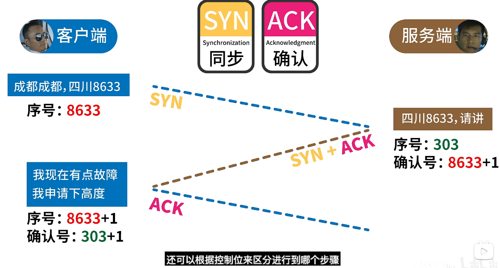
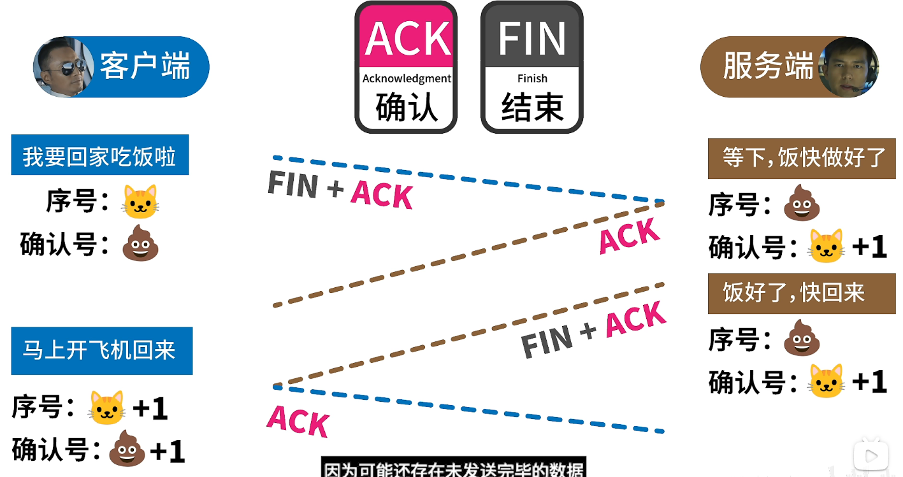

## ipv4和ipv6区别

### ipv4


### ipv6缩写
可以把0000进行缩写，并用::代替
由于如果把所有0都替换的话，如果出现两次::，则无法分辨省略了几个0，所以规定，只能省略一次，可省略任意位置。（待确认）
如下：
```
2001:8000:0:0:456:0:0:0
省略：
2001:8000::456:0:0:0
2001:8000:0:0:456::
```


以下为一种约定熟成的方式，但是其他方式也不会有错误


### TCP的三次握手和四次挥手

三次握手是建立链接，建立链接后，就可以发送http请求了


四次挥手是关闭链接，客户端和服务端都可以发送信号关闭链接
四次挥手，主要是因为可能中间会存在为发送完的数据，所以需要再发送一次FIN + ACK


### TCP


